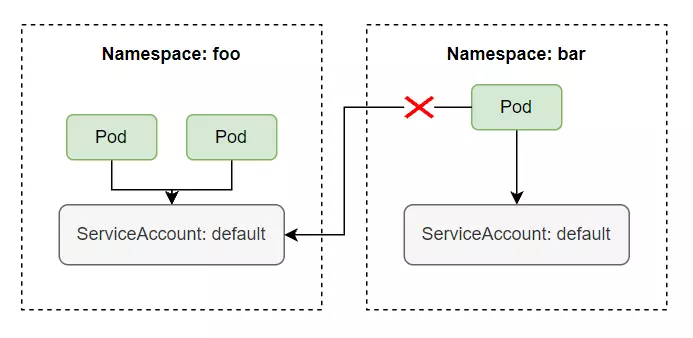
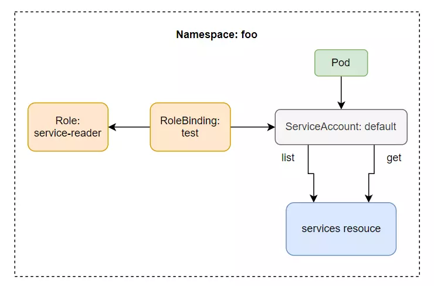
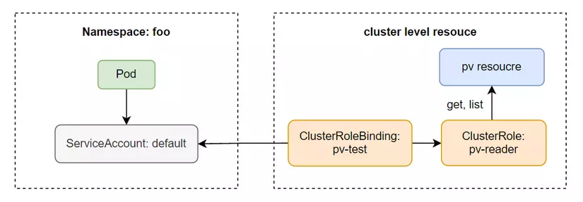
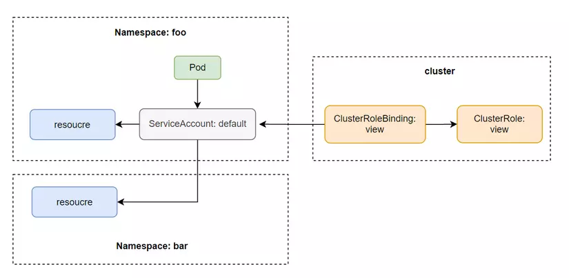

# Bài 13 - ServiceAccount and Role Based Access Control: security kubernetes API server

- Ở bài này chúng ta sẽ nói về ServiceAccount và Role Based Access Control (RBAC), cách để client có thể authentication tới API server dùng ServiceAccount, authorization dùng RBAC.

- Ở bài 10, chúng ta đã nói về cách một ứng dụng bên trong Pod có thể nói chuyện với API server bằng cách sử dụng ServiceAccount được mount vào bên trong Pod, bây giờ ta sẽ đi sâu hơn về resource ServiceAccount này.

# Hiểu về cách kubernetes API server thực hiện authentication

- Như chúng ta đã nói ở bài 10, API server có thể được config với một hay nhiều authentication plugins, khi một request đi tới API server nó sẽ đi qua hết các authen plugins này. Những plugin này sẽ phân tách những thông tin cần thiết như username, user id, group mà client thực hiện request thuộc về.

# Client

- Có 2 loại client được API server phân biệt rõ ràng:
    + Humans (users)
    + Pod (ứng dụng chạy bên trong container)

- Đối với user, thường sử dụng kubectl hoặc thực hiện một HTTP request với token để authentication tới API server. Còn đối với Pod, thì sẽ sử dụng ServiceAccount để authentication tới API server. Ở bài này chúng ta sẽ nói về cách Pod authentication tới API server.

# Groups

- Cả users và ServiceAccounts đề thuộc một hoặc nhiều group, group được dùng để grant permissions của tất cả user và ServiceAccounts nằm trong nó một lúc, thay vì phải grant permissions của từng thằng riêng lẽ.

- Group này được phân tách ra bằng authentication plugin cùng với thông username và user id, có 4 group mặc định là:
    + system:unauthenticated - được gán cho user không authenticated thành công.
    + system:authenticated - được gán cho user authenticated thành công.
    + system:serviceaccounts - group cho toàn bộ ServiceAccounts.
    + system:serviceaccounts:<namespace> - group cho toàn bộ ServiceAccounts trong một namespace.


# ServiceAccounts

- Như chúng ta đã nói, ServiceAccount sẽ được tự động mount vào bên trong container của Pod ở folder /var/run/secrets/kubernetes.io/serviceaccount. Gồm 3 file là ca.crt, namespace, token.

- File token này là file sẽ chứa thông tin của về Pod client, khi ta dùng nó để thực hiện request tới server, API server sẽ tách thông tin từ trong token này ra. Và ServiceAccount username của chúng ta sẽ có dạng dạng như sau system:serviceaccount:<namespace>:<service account name>, với system:serviceaccount:<namespace> là group và <service account name> là tên của ServiceAccount được sử dụng.

- Sau khi lấy được thông tin trên thì server sẽ truyền ServiceAccount username này tới authorization plugins, để xem ServiceAccount này có được quyền thực hiện action hiện tại lên trên API server hay không.

- Thì ServiceAccount thực chất chỉ là một resource để ứng dụng bên trong container sử dụng cho việc authenticated tới API server mà thôi. Ta có thể list ServiceAccount bằng câu lệnh:

```bash
$ kubectl get sa
NAME     SECRETS  AGE
default  1        10d
```

- Và ServiceAccount này là một namespace resouce, nghĩa là chỉ có scope bên trong một namespace, ta không thể dùng ServiceAccount của namespace này cho một namespace khác được. Và mỗi namespace sẽ có một ServiceAccount tên là default được tự động tạo ra khi một namespace được tạo. Một ServiceAccount có thể được sử dụng bởi nhiều Pod bên trong cùng một namespace.



# Sử dụng ServiceAccount để pull image từ private container registry

- Trong serires này thì chúng ta chỉ mới xài public container image chứ chưa xài private container image. Khi làm dự án thực tế thì ta sẽ cần sử dụng private container image chứ không xài public container image không, tại ta không bao giờ muốn container của sản phẩm chúng ta public trên mạng ai cũng tải về để chạy được. Thì để tải được image từ private registry về, ở trong config của Pod, ta phải khai báo thêm trường `imagePullSecrets`, như sau:

```bash
apiVersion: apps/v1
kind: Deployment
...
    spec:
      imagePullSecrets:
        - name: <secret-name> # secret use to pull image form private registry
      containers:
        - name: background-consume-queue
          image: registry.kala.ai/web-crm/background-consume-queue
...
```

- Trường imagePullSecrets name sẽ chứa Secret name mà ta sử dụng để pull image từ private registry về. Secret name này được tạo bằng cách sử dụng câu lệnh sau:

```bash
$ kubectl create secret docker-registry <secret-name> --docker-server=<your-registry-server> --docker-username=<your-name> --docker-password=<your-pword>
```

```bash
$ kubectl create secret docker-registry my-secret --docker-server=registry.kala.ai --docker-username=username --docker-password=12345678
```

```yaml
apiVersion: apps/v1
kind: Deployment
...
    spec:
      imagePullSecrets:
        - name: my-secret
      containers:
        - name: background-consume-queue
          image: registry.kala.ai/web-crm/background-consume-queue
...
```

- Vậy nếu muốn pull image từ private registry thì mỗi khi viết config ta phải thêm trường imagePullSecrets, ta có thể dùng ServiceAccount để tối giản bước này. Khi một Pod được tạo, ServiceAccount tên là default sẽ tự động được gán cho mỗi Pod.

```bash
$ kubectl get pod <pod-name> -o yaml
apiVersion: v1
kind: Pod
metadata:
  creationTimestamp: "2021-10-14T07:42:11Z"
  ...
spec:
  ...
  schedulerName: default-scheduler
  securityContext: {}
  serviceAccount: default # here
  serviceAccountName: default # here
  ...
```

- Ta sẽ thấy trường serviceAccount sẽ được tự động gán cho Pod với giá trị là ServiceAccount default. Ta thử xem config của một ServiceAccount.

```bash
$ kubectl describe sa default
Name:                default
Namespace:           default
Labels:              <none>
Annotations:         <none>
Image pull secrets:  <none>
Mountable secrets:   default-token-tnbgw
Tokens:              default-token-tnbgw
Events:              <none>
```

- Bạn để ý là config của một ServiceAccount được hiển thị ở trên có một trường tên là `Image pull secrets`, thì đây chính là trường có tác dụng tương tự như imagePullSecrets bên trong config của Pod, vậy những gì ta cần làm lúc này là cập nhật lại trường imagePullSecrets của default ServiceAccount, và ServiceAccount này sẽ tự động được gán vào trong Pod, và ta không cần khai báo trường imagePullSecrets trong mỗi config của Pod nữa, ta cập nhật trường imagePullSecrets của ServiceAccount như sau:

```bash
root@k8s-master-1:~# kubectl patch sa default --type='json' -p='[{"op":"add","path":"/imagePullSecrets","value":[{"name":"my-secret"}]}]'
serviceaccount/default patched
root@k8s-master-1:~# k describe sa default
Name:                default
Namespace:           default
Labels:              <none>
Annotations:         <none>
Image pull secrets:  my-secret
Mountable secrets:   <none>
Tokens:              <none>
Events:              <none>
root@k8s-master-1:~#
```

- Vậy là tất cả Pod trong default namespace của chúng ta có thể pull được image từ private registry mà ta không cần khai báo imagePullSecrets khi viết config cho Pod.

# Tạo ServiceAccount

- ServiceAccount là một resouce của kubernetes, vậy nên ta có thể tạo và xóa nó như các resouce khác một cách bình thường, kể cả nếu bạn xóa default ServiceAccount thì khi tạo Pod nó sẽ báo lỗi là không tìm thấy ServiceAccount để gán vào Pod thôi, thì khi ta xóa ServiceAccount default thì kubernetes sẽ tự động tạo lại một ServiceAccount mới cho ta, và Pod sẽ được tao ra lại bình thường.

- Hoặc bạn cũng có thể tạo một ServiceAccount khác và chỉ định Pod sử dụng ServiceAccount mới này thay vì dùng default ServiceAccount. Để tạo ServiceAccount thì cũng rất đơn giản, ta chỉ cần gõ câu lệnh:

```bash
$ kubectl create sa bar
serviceaccount/bar created
$ kubectl describe sa bar
Name:                bar
Namespace:           default
Labels:              <none>
Annotations:         <none>
Image pull secrets:  <none>
Mountable secrets:   bar-token-ndvtr
Tokens:              bar-token-ndvtr
Events:              <none>
```

- Ở trên khi ta describe một SA thì thấy nó có một trường tên là `Mountable secrets`, đây là tên của Secret được gán cho SA, khi một SA được tạo ra thì nó cũng sẽ tạo ra một Secret cho ta.

```bash
$ kubectl get secret
NAME                 TYPE                                 DATA
bar-token-ndvtr      kubernetes.io/service-account-token  3
default-token-4fsjr  kubernetes.io/service-account-token  3
$ kubectl describe secret bar-token-ndvtr
Name:         bar-token-ndvtr
Namespace:    default
...
ca.crt:     1066 bytes
namespace:  7 bytes
token:      ...
...
```

===> Khi ta describe secret được tạo ra bởi SA, ta sẽ thấy nó chứa 3 file, là 3 file mà sẽ được mount vào bên trong container của Pod ở folder /var/run/secrets/kubernetes.io/serviceaccount.


```
- Điều bạn đang gặp phải là một thay đổi trong cách Kubernetes quản lý ServiceAccount tokens trong các phiên bản gần đây. Mặc dù lệnh kubectl describe sa không hiển thị Mountable secrets hoặc Tokens, điều này không có nghĩa là ServiceAccount không có token nào được gắn vào Pod khi sử dụng nó. Điều này xảy ra do sự thay đổi trong cơ chế quản lý token của Kubernetes.

- Giải thích:
1. Tự động gắn token động (Projected ServiceAccount Token): Kể từ Kubernetes phiên bản 1.21, Kubernetes sử dụng Projected ServiceAccount Token thay vì quản lý token tĩnh. Điều này có nghĩa là:

- Token của ServiceAccount được gắn vào Pod một cách động thông qua Volume Projection.
- Token này có thời hạn ngắn (thường là 1 giờ) và được tự động làm mới.
Mặc dù kubectl describe sa không hiển thị token, nhưng Kubernetes vẫn sẽ - gắn token này vào mỗi Pod sử dụng ServiceAccount đó thông qua cơ chế volume ở đường dẫn /var/run/secrets/kubernetes.io/serviceaccount.

2. Đường dẫn /var/run/secrets/kubernetes.io/serviceaccount: Bên trong Pod, bạn vẫn thấy thư mục này chứa các thông tin sau:

- ca.crt: Chứng chỉ CA của Kubernetes.
- token: Token JWT dùng để xác thực với API server của Kubernetes.
- namespace: Namespace của Pod.

==> Điều này xảy ra vì Kubernetes tự động gắn các secrets này vào Pod sử dụng Volume Mount dù không có "Mountable secrets" hoặc "Tokens" được liệt kê trong kubectl describe sa.

## Tóm tắt:
- ServiceAccount tokens không còn được tạo ra và lưu trữ như secrets truyền thống (có thể mount thông qua secrets) nữa.
- Thay vào đó, Kubernetes tự động gắn các token động vào Pod thông qua Projected ServiceAccount Tokens, nên thư mục /var/run/secrets/kubernetes.io/serviceaccount vẫn có mặt và chứa token JWT.
```

- Để sử dụng ServiceAccount khác default bên trong Pod thì ta chỉ định ở trường `spec.serviceAccountName`.

```bash
apiVersion: apps/v1
kind: Deployment
...
    spec:
      serviceAccountName: bar
      containers:
        - name: background-consume-queue
          image: registry.kala.ai/web-crm/background-consume-queue
...
```

- Vậy ta có cần tạo một SA khác không hay dùng một thằng thôi cho nhanh? Thì để trả lời vấn để này `thì mặc định một thằng SA nếu ta không bật Role Based Access Control authorization plugin thì nó sẽ có quyền thực hiện mọi hành động lên API server`, nghĩa là một thằng ứng dụng trong container có thể sử dụng SA để authentication tới API server và thực hiện list Pod, xóa Pod, tạo Pod mới một cách bình thường, vì nó có đủ quyền. Thì để ngăn chặn việc đó, ta cần enable Role Based Access Control authorization plugin.

# Role Based Access Control

- Thì kể từ version 1.8.0, RBAC sẽ được enable mặc định, và ta có thể tạo Role và gán với từng SA nhất định. Chỉ cho phép một SA thực hiện những hành động mà ta cho phép, theo `Principle of Least Privilege`.

## Action
- Các action ta có thể thực hiện tới API server là HEAD, GET, POST, PUT, PATCH, DELETE. Và những action này sẽ tương ứng với một verb mà ta sẽ dùng khi định nghĩa role.


## RBAC resources

- RBAC sẽ có các resouce như sau:
    + Roles: định nghĩa verb nào có thể được thực hiện lên trên namespace resouce
    + ClusterRoles: định nghĩa verb nào có thể được thực hiện lên trên cluster resouce
    + RoleBindings: gán Roles tới một SA
    + ClusterRoleBindings: gán ClusterRoles tới SA

- Điểm khác nhau của Roles và ClusterRoles là Roles là namespace resouce, nghĩa là nó sẽ thuộc về một namespace nào đó, và chỉ định nghĩa role cho SA trong một namespace. Còn ClusterRoles thì sẽ không thuộc namespace nào cả.


## Tạo Role và RoleBinding
- Bây giờ ta sẽ thực hành tạo Role và Clusterrole để hiểu rõ hơn về lý thuyết. Trước tiên ta sẽ tạo 2 namespace:

```bash
$ kubectl create ns foo
namespace/foo created
$ kubectl create ns bar
namespace/bar created
$ kubectl run test --image=luksa/kubectl-proxy -n foo
pod/test created
$ kubectl run test --image=luksa/kubectl-proxy -n bar
pod/test created
```

- Truy cập vào Pod và thực hiện request.

```bash
$ kubectl exec -it test-145485760-ttq36 -n foo sh
/# curl localhost:8001/api/v1/namespaces/foo/services
User "system:serviceaccount:foo:default" cannot list services in the
namespace "foo".
```

- Ta sẽ thấy là với RBAC được enable thì SA bây sẽ không có quyền gì cả. Để cho phép thằng default SA ở namespace foo có thể list được service trong namespace foo, thì ta cần phải tạo một Role và dùng RoleBinding để gán quyền cho default SA này. Tạo một file tên là service-reader.yaml với config như sau:

```yaml
apiVersion: rbac.authorization.k8s.io/v1
kind: Role
metadata:
  namespace: foo
  name: service-reader
rules:
  - apiGroups: [""]
    resources: ["services"]
    verbs: ["get", "list"]
```

```bash
$ kubectl apply -f service-reader.yaml -n foo
```

- Ở file config trên, thuộc tính apiGroups ta sẽ chỉ định nhóm của api ta muốn thực hiện hành động lên nó, ở trên ta chỉ định "" có nghĩa là core api group /v1 path, nếu ta muốn thực hiện hành động lên deployment thì ta sẽ chỉ định apiGroups là apps/v1. Trường verb chỉ định action ta có thể thực hiện lên api group group trên, trường resources ta chỉ định là Service resources. Khi ta tạo Role xong, ta cần binding nó tới SA bằng cách dùng câu lệnh như sau:

```bash
$ kubectl create rolebinding test --role=service-reader --serviceaccount=foo:default -n foo
```

- Hoặc viết file config như sau:

```bash
apiVersion: rbac.authorization.k8s.io/v1
kind: RoleBinding
metadata:
  name: test
  namespace: foo
roleRef:
  apiGroup: rbac.authorization.k8s.io
  kind: Role # this must be Role or ClusterRole
  name: service-reader # this must match the name of the Role or ClusterRole you wish to bind to
subjects:
  - kind: ServiceAccount # Kind is User or ServiceAccount
    name: default # name of the SA
    namespace: foo
```



- Bây giờ thì khi ta có thể gọi API list service bên trong Pod được rồi.

```bash
# curl localhost:8001/api/v1/namespaces/foo/services
{
  "kind": "ServiceList",
  "apiVersion": "v1",
  "metadata": {
    "resourceVersion": "65713"
  },
  "items": []
```

- Ta cũng có thể sử dụng Rolebinding `ở namespace này cho SA ở một namespace khác`. Bằng cách thêm SA vào trường subjects của Rolebinding.

```bash
$ kubectl edit rolebinding test -n foo
...
subjects:
...
- kind: ServiceAccount
  name: default
  namespace: bar

```

- Khi ta thêm subject trên thì bây giờ SA ở namespace bar có thể đọc được services ở namespace foo.


## Tạo ClusterRole và ClusterRoleBinding

- Giờ thì ta sẽ qua phần tạo ClusterRole, ClusterRole cho phép một SA có thể truy cập được resouce của Cluster như Node, PersistentVolume, v...v... Ở trong Pod hiện tại, khi ta thực hiện API request để list persistentvolumes thì ta sẽ gặp lỗi.

```bash
/# curl localhost:8001/api/v1/persistentvolumes
User "system:serviceaccount:foo:default" cannot list persistentvolumes at the
cluster scope.
```

- Để thực hiện được action này, ta phải tạo ClusterRole, tạo file tên là pv-reader với config như sau:

```bash
apiVersion: rbac.authorization.k8s.io/v1
kind: ClusterRole
metadata:
  name: pv-reader
rules:
  - apiGroups: [""]
    verbs: ["get", "list"]
    resources: ["persistentvolumes"]
```

- Config của ClusterRole cũng giống như Role, ta chỉ cần thay kind từ Role sang ClusterRole và không cần phải chỉ định namespace.

```bash
$ kubectl apply -f pv-reader.yaml
```

- Sau đó ta tạo ClusterRoleBinding:

```bash
$ kubectl create clusterrolebinding pv-test --clusterrole=pv-reader --serviceaccount=foo:default
```

- Bây giờ thì ta đã có thể gọi tới API server để list PV.

```bash
/ # curl localhost:8001/api/v1/persistentvolumes
{
  "kind": "PersistentVolumeList",
  "apiVersion": "v1",
  "metadata": {
    "resourceVersion": "66051"
  },
  "items": []
}
...
```



# ClusterRole và ClusterRoleBinding mặc định

- Kubernetes có một có ClusterRole và ClusterRoleBinding mặc định, ta có thể list nó ra bằng câu lệnh:

```bash
$ kubectl get clusterroles
NAME
admin
cluster-admin
edit
...
system:discovery
...
view
...
$ kubectl get clusterrolebindings
admin
cluster-admin
edit
...
system:discovery
...
view
...
```

## Truy cập non-resource URLs với system:discovery

- Kubernetes API server sẽ được chia làm 2 loại chính là: các url liên quan tới resource và những url không liên quan tới resouce (được gọi là non-resource URLs). Resource URLs là các url sẽ liệt kê resource và thực hiện các thao tác lên resource, còn các non-resource URLs thì sẽ không có tương tác nào liên quan trực tiếp tới các resource hết, ví dụ như là url dùng để list hết tất cả các url mà API server hỗ trợ.

- Đối với non-resource URLs thì kể cả client authenticated hoặc unauthenticated với API server đều truy cập được những non-resource URLs này, role này được định nghĩa trong `system:discovery` ClusterRole và ClusterRoleBinding.

- Ta xem thử config của system:discovery:

```bash
root@k8s-master-1:/k8s-practice/viblo/bai13# kubectl get clusterrole system:discovery -o yaml
apiVersion: rbac.authorization.k8s.io/v1
kind: ClusterRole
metadata:
  annotations:
    rbac.authorization.kubernetes.io/autoupdate: "true"
  creationTimestamp: "2024-10-15T13:01:31Z"
  labels:
    kubernetes.io/bootstrapping: rbac-defaults
  name: system:discovery
  resourceVersion: "74"
  uid: d0af8ac6-44ef-480f-a6c7-f1a78125758d
rules:
- nonResourceURLs:
  - /api
  - /api/*
  - /apis
  - /apis/*
  - /healthz
  - /livez
  - /openapi
  - /openapi/*
  - /readyz
  - /version
  - /version/
  verbs:
  - get
root@k8s-master-1:/k8s-practice/viblo/bai13#
```

- Ta sẽ thấy role này sẽ định nghĩa ta có quyền get những thông tin của các non-resource URLs được định nghĩa ở trường nonResourceURLs. Ở trên ta có nói về group, là cách để ta grant permission cho một nhóm user hay vì từng thằng riêng lẻ. Thì thằng `system:discovery` ClusterRoleBinding sẽ bind role tới toàn bộ user thuộc group authenticated, unauthenticated.

```bash
$ kubectl get clusterrolebinding system:discovery -o yaml

apiVersion: rbac.authorization.k8s.io/v1
kind: ClusterRoleBinding
metadata:
    name: system:discovery
...
roleRef:
    apiGroup: rbac.authorization.k8s.io
    kind: ClusterRole
    name: system:discovery # bind to ClusterRole
subjects:
    - apiGroup: rbac.authorization.k8s.io
      kind: Group
      name: system:authenticated # group authenticated
    - apiGroup: rbac.authorization.k8s.io
      kind: Group
      name: system:unauthenticated # group unauthenticated
```

## Liệt kê toàn bộ resouce trong một namspace với view ClusterRole

- `view ClusterRole` sẽ định nghĩa toàn bộ role cho phép chúng ta có thể list toàn bộ resouce bên trong một namespace. Ta coi thử config của view:

```bash
$ kubectl get clusterrole view -o yaml
apiVersion: rbac.authorization.k8s.io/v1
kind: ClusterRole
metadata:
    name: view
...
rules:
    - apiGroups:
    - ""
resources:
    - configmaps
    - endpoints
    - persistentvolumeclaims
    - pods
    - replicationcontrollers
    - replicationcontrollers/scale
    - serviceaccounts
    - services
verbs:
    - get
    - list
    - watch
...

```

- Để sử dụng `view ClusterRole` thì chỉ cần tạo ClusterRoleBinding cho nó:

```bash
$ kubectl create clusterrolebinding view --clusterrole=view --serviceaccount=foo:default
```

- Và vì nó là ClusterRole, nên thằng SA trong foo namespace cũng có thể list được các resouce khác namespace của nó. N`hưng ta không thể dùng nó để đọc cluster resouce được, vì nó chỉ có scope đối với namespace resouce.` Bên trong pod của foo namespace

```bash
/# curl localhost:8001/api/v1/namespaces/foo/pods
{
  "kind": "PodList",
  "apiVersion": "v1",
  ...

/# curl localhost:8001/api/v1/namespaces/bar/pods
{
  "kind": "PodList",
  "apiVersion": "v1",
  ...

```



## Update resouce với edit ClusterRole
- `eidt ClusterRole` sẽ kế thừa toàn bộ role của `view` và bên cạnh đó nó còn định nghĩa thêm role cho phép chúng ta thực hiện các verb create, update, patch, delete tất cả các resouce bên trong một namespace, ngoài trừ Secret, Role, RoleBinding

## Toàn quyền trên namespace với admin ClusterRole

- `admin ClusterRole` này cho phép chúng ta có toàn quyền trên một namespace, kể cả edit Secret, Role, RoleBinding. Ngoài trừ ResourceQuotas (sẽ nói ở bài khác). `Điểm khác nhau giữa edit và admin là thằng admin có thể sửa Secret, Role, RoleBinding. Còn thằng edit thì không.`

## Toàn quyền trên cluster với cluster-admin ClusterRole

- Thì thằng này là thằng sẽ cung cấp cho chúng ta có mọi quyền trên API server, cross namepspace, có thể truy cập cluster resource.

## system:* ClusterRole

- Khi ta liệt kê ClusterRole ra ta sẽ thấy có rất nhiều ClusterRole mặc định, trong đó có một vào thằng prefix với system:, thì đây là những ClusterRole được các kubernetes component sử dụng. Ví dụ system:kube-scheduler được sử dụng bởi Scheduler.