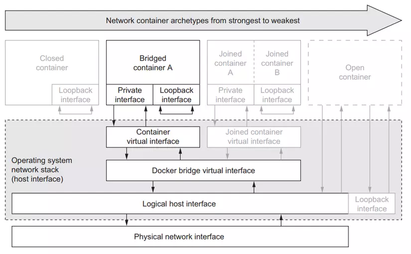

# Bài 14 - PodSecurityPolicies - NetworkPolicy: security cho cluster nodes và network

- Pod Security Policy đã bị xóa ở phiên bản 1.25

# Giới thiệu

- Chào các bạn tới với series về kubernetes. Đây là bài thứ 14 trong series của mình, ở bài trước chúng ta đã nói về cách security kubernetes API server. Ở bài này chúng ta sẽ nói về security cho cluster nodes và network của node trong trường hợp container có thể truy cập được ra bên ngoài node server.

- Nếu các bạn có câu hỏi làm quái gì chúng ta phải cần security cho cluster nodes, chẳng phải khi chúng ta chạy một thằng container thì môi trường bên trong một container sẽ hoàn toàn riêng biệt với server bên ngoài của ta hay sao. Làm sao mà một thằng container có thể truy cập được ra bên ngoài woker node được mà chúng ta cần phải security cho nó?

- Để trả lời vấn đề này thì thằng kubernetes có cho phép ta config để một container có thể truy cập ra ngoài node server được, tại sao phải như vậy thì do sẽ có một số trường hợp ta cần container của ta phải có quyền truy cập được ra bên ngoài server thì application của ta mới chạy được. Ví dụ là một application cần monitor toàn bộ network của node, nếu ta không có quyền truy cập ra bên ngoài node thì làm sao ta monitor được. Nhưng ta chỉ muốn container của Pod nào ta cho phép thì mới có thể truy cập được ra bên ngoài node. Chứ không phải tất cả container của Pod nào cũng có thể truy cập được, nên ta mới cần cách để ta security cho cluster nodes và network, nếu container nào mà ta không muốn thì nó không thể truy cập được ra bên ngoài node được.

- Đầu tiên chúng ta sẽ nói về cách config container để nó có thể truy cập được node server và network, sau đó ta sẽ nói vể cách để security.

# Truy cập host network của node server từ bên trong container của Pod

- Để hiểu cách một container bên trong Pod sẽ truy host network của node ra sao, trước tiên ta sẽ xem network của một container sẽ được tổ chức ra sao. Thì tùy vào công cụ ta dùng để chạy container thì nó sẽ khác nhau, nhưng kiến trúc thì sẽ tương tự giống nhau. Ở đây ta sẽ nói về container network của thằng docker.

## Docker container networking

- Mỗi thằng container sẽ có một loopback interface và private Ethernet interface riêng. Ethernet interface là một điểm nối được dùng để kết nối với một Ethernet interface hoặc network bên ngoài, để một container có thể thông qua nó để đi ra ngoài internet. Loopback interface là một virtual interface, cho phép các ứng dụng bên trong container có thể nói chuyện được với nhau bằng http protocol thông qua localhost, `đây là lý do tại sao khi mà ở bên trong một container, mà nếu bạn dùng localhost bên trong container để kết nói với một ứng dụng cài bên ngoài server nó lại không chạy`, vì thằng loopback interface này nó chỉ nằm trong container thôi.


- Network của một container sẽ được tổ chức theo 4 dạng như sau:
    + Closed containers
    + Bridged containers
    + Joined containers
    + Open containers


## Closed containers

- Dạng container network này sẽ không cho phép bất kì một traffic nào truy cập vào nó, kể cả ứng dụng từ bên trong nó truy cập ra ngoài internet. Tất cả các ứng dụng trong container này chỉ có thể nói chuyển với nhau thông qua loopback interface, không thể nói chuyện với bên ngoài.


## Bridged containers

- Ở dạng container network này thì các ứng dụng bên trong container đã có thể nói chuyện được với internet bên ngoài thông qua một Ethernet interface.



## Open containers

- Và ở dạng container network cuối cùng thì hoàn toàn open, nó sẽ không có loopback interface và private Ethernet interface riêng gì cả, đây là dạng container sử dụng hoàn toàn host network của node server. Nếu ở dạng container network này, bạn có thể dùng localhost để kết nối với ứng dụng ở trên node server bình thường

## Truy cập host network từ Pod

- Thì thằng kubernetes có cho phép ta config Pod để thằng container bên trong nó có thể sử dụng hostnetwork của worker node được. Ta sử dụng thuộc tính `hostNetwork` và với giá trị là true. Ví dụ như sau, tạo file pod-with-host-network.yaml:

```yaml
apiVersion: v1
kind: Pod
metadata:
  name: pod-with-host-network
spec:
  hostNetwork: true # use host network of the node
  containers:
    - name: main
      image: alpine
      command: ["/bin/sleep", "999999"]
```

- Khi ta tạo pod và truy cập vào trong container, gõ ifconfig ta sẽ thấy lúc này container đã sử dụng host network của node.

```bash
$ kubectl apply -f pod-with-host-network.yaml
pod/pod-with-host-network created

$ kubectl exec pod-with-host-network ifconfig
ens33     Link encap:Ethernet  HWaddr 00:0C:29:A7:03:7F
          inet addr:192.168.254.111  Bcast:192.168.254.255  Mask:255.255.255.0


lo        Link encap:Local Loopback
          inet addr:127.0.0.1  Mask:255.0.0.0
```

```bash
$ kubectl apply -f pod-with-host-network.yaml
pod/pod-with-host-network created

$ kubectl exec pod-with-host-network ifconfig
eth0: flags=4163<UP,BROADCAST,RUNNING,MULTICAST>  mtu 1500
        inet 172.28.207.121  netmask 255.255.240.0  broadcast 172.28.207.255
        ...
lo: flags=73<UP,LOOPBACK,RUNNING>  mtu 65536
        inet 127.0.0.1  netmask 255.0.0.0
        ...
```


- Giờ container trong Pod có thể sử dụng localhost để truy cập ứng dụng bên ngoài node.

## Truy cập node’s PID và IPC

- Tương tự như hostNetwork, ta sẽ có 2 thuộc tính là hostPID và hostIPC `để container bên trong Pod có thể truy cập được PID và IPC của node`. Khi ta làm vậy thì ứng dụng bên trong container có thể thấy được các ứng dụng đang chạy trên worker node của ta, và cũng có thể nói chuyện với các ứng dụng đó thông qua IPC (Inter-process communication). Có nghĩa là nếu chúng ta chạy container v`ới 2 thuộc tính trên thì khi ta list process bên trong container, ta có thể thấy được toàn bộ PID của các process khác trên worker node`. Ví dụ tạo file config pod-with-host-pid-and-ipc.yaml như sau:

```yaml
apiVersion: v1
kind: Pod
metadata:
  name: pod-with-host-pid-and-ipc
spec:
  hostPID: true # use host pid of the node
  hostIPC: true # use host ipc of the node
  containers:
    - name: main
      image: alpine
      command: ["/bin/sleep", "999999"]
```

```bash
$ kubectl apply -f pod-with-host-pid-and-ipc.yaml
pod/pod-with-host-pid-and-ipc created

$ kubectl exec pod-with-host-pid-and-ipc ps aux
PID USER  TIME  COMMAND
1   root  0:01  /usr/lib/systemd/systemd --switched-root --system ...
2   root  0:00  [kthreadd]
3   root  0:00  [ksoftirqd/0]
5   root  0:00  [kworker/0:0H]
6   root  0:00  [kworker/u2:0]
...
```

## Sử dụng container’s security context

- Bên cạnh một số thuộc tính để container truy cập được ra node server. Thì kubernetes có cung cấp cho ta thuộc tính `securityContext`, cho phép có thể config một số thuộc tính container như sau:
- Chỉ định userid và groupid cho container.
- Ngăn chặn container run với root user.
- Chạy container với privileged mode, cho phép container có toàn quyền với node’s kernel.
- Cấu hình fine-grained privileges.
- Chặn process có thể ghi vào trong filesystem của container.
- ...

### Chỉ định user khi chạy container

- Khi ta chạy một container, thì mặc định nó sẽ chạy với root user bên trong container, nghĩa là khi ta truy cập vào container, và có thể tạo file hoặc xóa file và làm bất cứ thứ gì mà root user có thể làm bên trong container.

```bash
$ kubectl run pod-with-defaults --image alpine --restart Never -- /bin/sleep 999999
pod/pod-with-defaults created

$ kubectl exec pod-with-defaults id
uid=0(root) gid=0(root) groups=0(root), 1(bin), 2(daemon), 3(sys), 4(adm),
6(disk), 10(wheel), 11(floppy), 20(dialout), 26(tape), 27(video)
```

- Ta sẽ thấy uid=0(root) gid=0(root) groups=0(root), container của chúng đang chạy với root user. Thì ta có thể chỉ định user không phải root khi chạy container, bằng cách sử dụng thuộc tính `securityContext.runAsUser`. Ví dụ:

```yaml
apiVersion: v1
kind: Pod
metadata:
  name: pod-as-user-guest
spec:
  containers:
    - name: main
      image: alpine
      command: ["/bin/sleep", "999999"]
      securityContext:
        runAsUser: 1000
```

- Ở file trên ta chỉ định thuộc tính là 1000. Khi ta tạo pod và chạy lại câu lệnh xem id của user thì ta sẽ thấy bây giờ user của chúng ta không phải là `root` nữa.

```bash
$ kubectl exec pod-as-user-guest id
uid=1000(guest) gid=1000(users)
```

- `Nếu ta chạy như vậy thì bây giờ khi ta truy cập vào container, ta sẽ không có quyền tạo file hoặc xóa file nào mà nằm ở những folder mà chỉ root có quyền.`

### Ngăn chặn container chạy root user

- `Nếu ta không chắc user mà ta muốn chỉ định cho container,` bởi vì container ta pull từ trên mạng xuống chứ không phải ta tự build, mà chỉ cần nó không phải chạy như root là được, thì ta có thể sử dụng thuộc tính `runAsNonRoot`. Ví dụ:

```yaml
apiVersion: v1
kind: Pod
metadata:
  name: pod-run-as-non-root
spec:
  containers:
    - name: main
      image: alpine
      command: ["/bin/sleep", "999999"]
  securityContext:
    runAsNonRoot: true # This container will only be allowed to run as a non-root user.
```

###  Chạy Pod với privileged mode

- Sẽ có những trường hợp, ta cần container bên trong Pod có đủ quyền truy cập vào node server. Ví dụ dễ hiểu là thằng kube-proxy pod ta đã nói ở bài Kubernetes internals architecture, nó cần có đủ quyền thì mới có thể modify iptables rule được. Để cấp cho container có đủ quyền thì ta sử dụng thuộc tính `privileged`. Ví dụ, tạo file pod-privileged.yaml:

```yaml
apiVersion: v1
kind: Pod
metadata:
  name:  pod-privileged
spec:
  containers:
    - name: main
      image: alpine
      command: ["/bin/sleep", "999999"]
      securityContext:
        privileged: true
```

- Bây giờ thì thằng container có đủ quyền để thực hiện hành động trên worker node, để hiểu hơn thì ta tạo Pod và so sánh với thằng pod-with-defaults ta đã tạo ở trên.

```bash
$ kubectl apply -f pod-privileged.yaml
pod/pod-privileged created

$ kubectl exec -it pod-with-defaults ls /dev
core    null    stderr           urandom
fd      ptmx    stdin            zero
full    pts     stdout
fuse    random  termination-log
mqueue  shm     tty
```

```bash
root@k8s-master-1:/k8s-practice/viblo/bai14# kubectl exec -it pod-with-defaults ls /dev
core             null             shm              termination-log
fd               ptmx             stderr           tty
full             pts              stdin            urandom
mqueue           random           stdout           zero
root@k8s-master-1:/k8s-practice/viblo/bai14# kubectl exec -it pod-privileged ls /dev
autofs           sda2             tty41            ttyS28
bsg              sda3             tty42            ttyS29
btrfs-control    sg0              tty43            ttyS3
bus              sg1              tty44            ttyS30
core             shm              tty45            ttyS31
cpu              snapshot         tty46            ttyS4
cpu_dma_latency  snd              tty47            ttyS5
cuse             sr0              tty48            ttyS6
dm-0             stderr           tty49            ttyS7
dma_heap         stdin            tty5             ttyS8
dmmidi           stdout           tty50            ttyS9
dri              termination-log  tty51            ttyprintk
```

- Giờ thì ta sẽ thấy có nhiều device được hiển thị ra hơn. `Vì thằng container với privileged mode có quyền thấy toàn bộ device của node server.`

### Thêm kernel capabilities riêng lẽ cho container

- Như bạn thấy ở trên thì privileged mode sẽ cho container có toàn quyền, nhưng sẽ có trường hợp ta không muốn nó có toàn quyền, mà chỉ một số quyền thôi, thì ta có thể sử dụng thuộc tính `capabilities`. Ví dụ thằng pod-with-defaults của ta sẽ không có quyền thay đổi thực hiện câu lệnh date.

```bash
$ kubectl exec -it pod-with-defaults -- date +%T -s "12:00:00"
date: can't set date: Operation not permitted
```

- Để pod có thể thực hiện câu lệnh date, ta cần thêm quyền cho nó. Ví dụ:

```yaml
apiVersion: v1
kind: Pod
metadata:
  name: pod-add-settime-capability
spec:
  containers:
    - name: main
      image: alpine
      command: ["/bin/sleep", "999999"]
      securityContext:
        capabilities: # Capabilities are added or dropped under the securityContext property.
          add: # use add
            - SYS_TIME # add the SYS_TIME capability.
```

- Thuộc tính capabilities thì ta có thể chỉ là add hoặc drop. Ở config trên thì ta chỉ thêm thuộc tính. Khi ta tạo và truy cập vào pod để thực hiện câu kệnh date, ta sẽ thấy bây nó thực hiện được.

```bash
$ kubectl exec -it pod-add-settime-capability -- date +%T -s "12:00:00"
12:00:00
```

### Chặn process có thể ghi vào trong filesystem của container

- Sẽ có trường hợp ta cần chặn process bên trong container có thể ghi vào trong filesystem của container, ví dụ, ta chạy ứng dụng nodejs, có config cổng thanh toán ta đọc từ file bên trong container, nếu có ai đó truy cập vào được container của chúng ta, sửa lại file config cổng thanh toán này thành thông tin của họ, lúc này tiền của ta sẽ qua họ. Để ngăn chặn việc này, ta sẽ sử dụng thuộc tính `readOnlyRootFilesystem`. Ví dụ như sau:

```yaml
apiVersion: v1
kind: Pod
metadata:
  name: pod-with-readonly-filesystem
spec:
  containers:
    - name: main
      image: alpine
      command: ["/bin/sleep", "999999"]
      securityContext:
        readOnlyRootFilesystem: true # This container’s filesystem can’t be written to
```

- Ta có thể thấy là một thằng container có thể dùng nhiều cách để truy cập ra ngoài node server của chúng ta, developer quyền truy cập vào cluster của chúng ta cũng có thể tạo container với quyền mà họ muốn, có khi họ không hiểu nhiều về security mà chỉ biết nếu thêm thuộc tính đó thì ứng dụng sẽ chạy được nên họ cứ thêm vào thôi. Thì với vai trò là một cluster administrator, bạn có thể ngăn chặn việc developer có thể tạo Pod với quyền mà họ chỉ định trong Pod.

# PodSecurityPolicy

- Đây là một cluster resouce, dùng để chỉ định những thuộc tính nào mà developer có thể sử dụng và không thể sử dụng cho Pod của họ. Khi bạn khai báo một PodSecurityPolicy, thì nó sẽ được thêm vào `Admission control plugin` ta đã nói ở bài 11. Khi một developer tạo Pod, config của Pod sẽ được đưa qua plugin này để kiểm tra theo policy chúng ta định nghĩa. Nếu Pod sử dụng thuộc tính security context nào mà ta không cho phép, nó sẽ không được tạo và API server sẽ trả về lỗi cho developer.


- PodSecurityPolicy có thể định nghĩa các policy những sau đây:
    - Pod có thể sử dụng host’s IPC, PID, hostNetwork hay không
    - UserID nào container có thể sử dụng
    - Có thể sử dụng privileged mode hay không
    - Những kernel capabilities nào được cho phép thêm hoặc xóa
    - Container có thể xài thuộc tính readOnlyRootFilesystem hay không
    - Pod có thể xài volume gì
    - ...

- Ví dụ, tạo file pod-security-policy.yaml như sau:

```bash
apiVersion: extensions/v1
kind: PodSecurityPolicy
metadata:
  name: default
spec:
  hostIPC: false # aren’t allowed to use the hostIPC
  hostPID: false # aren’t allowed to use the hostPID
  hostNetwork: false # aren’t allowed to use the hostNetwork
  privileged: false # aren’t allowed to use privileged
  readOnlyRootFilesystem: true # allowed to use readOnlyRootFilesystem
  runAsUser:
    rule: RunAsAny # can run as any user
  fsGroup:
    rule: RunAsAny # can run as any group
  supplementalGroups:
    rule: RunAsAny
  volumes:
    - '*' # All volume types can be used in pods.
```

- Ở file config trên, ta không cho phép Pod xài thuộc tính hostIPC, hostPID, hostNetwork và privileged. Có thể xài thuộc tính readOnlyRootFilesystem. Có thể chạy container với bất kì user nào. Và Pod có thể xài bất kì loại volume nào. Khi ta tạo PodSecurityPolicy này, thì bây giờ ta thử tạo Pod trong file pod-privileged.yaml thì nó sẽ báo lỗi.

```bash
$ kubectl apply -f pod-security-policy.yaml
podsecuritypolicy/default created

$ kubectl aplly -f pod-privileged.yaml
Error from server (Forbidden): error when creating "pod-privileged.yaml":
pods "pod-privileged" is forbidden: unable to validate against any pod
security policy: [spec.containers[0].securityContext.privileged: Invalid
value: true: Privileged containers are not allowed]
```


==>  Đây là cách để ta ngăn chặn developer tạo Pod với quyền ta không mong muốn. Nhưng mà ta nói ở trên là thằng PodSecurityPolicy này là `cluster resouce, nghĩa là nó sẽ apply trên toàn bộ cluster và toàn bộ user, vậy thì làm sao ta có thể apply policy cho từng namespace và từng user?`


```
- Vì PodSecurityPolicy (PSP) đã bị loại bỏ từ Kubernetes 1.25 và không còn hỗ trợ trong API extensions/v1, bạn sẽ cần chuyển sang cơ chế mới hơn hoặc sử dụng các công cụ thay thế để quản lý chính sách bảo mật.

## Phương án thay thế với Pod Security Admission:
- Bạn có thể chuyển từ PSP sang Pod Security Admission. Tính năng này có ba mức bảo mật chính: privileged, baseline, và restricted. Dưới đây là cách triển khai chính sách tương tự như PSP bạn đã cấu hình bằng cách sử dụng nhãn (label) trên namespace.

1. Bước 1: Chọn namespace nơi bạn muốn áp dụng chính sách bảo mật. Ví dụ, áp dụng cho namespace default:

kubectl label namespace default pod-security.kubernetes.io/enforce=restricted

kubectl label namespace default pod-security.kubernetes.io/enforce-


2. Bước 2: Kiểm tra cấu hình bảo mật. Mức độ bảo mật restricted tương ứng với chính sách nghiêm ngặt, bao gồm:

- Cấm sử dụng privileged.
- Cấm sử dụng hostNetwork, hostPID, hostIPC.
- Yêu cầu readOnlyRootFilesystem và hạn chế quyền runAsUser.
- Mức bảo mật này tương đối phù hợp với cấu hình PSP mà bạn đã định nghĩa.

## Giải pháp 2: Sử dụng công cụ bên ngoài
- Nếu bạn vẫn muốn sử dụng chính sách bảo mật tương tự như PSP trong các phiên bản Kubernetes hiện đại, bạn có thể cân nhắc các công cụ bảo mật bên ngoài như:

    - OPA (Open Policy Agent) với Gatekeeper.
    - Kyverno: Một công cụ policy engine phổ biến có thể thay thế cho PodSecurityPolicy.
```

## Gán PodSecurityPolicies cho từng user

- Thì để giải quyết vấn đề này, ta sẽ sử dụng RBAC mà ta đã nói ở bài trước. Ta sẽ tạo ClusterRole và gán nó tới PodSecurityPolicies theo tên, và dùng ClusterRoleBinding để gán ClusterRole đó tới user. Và muốn chỉ namespace scope, ta viết thêm Role chỉ cho phép user đó truy cập một namespace. Ta sẽ làm ví dụ cho dễ hiểu, tạo một file psp-privileged.yaml:

```yaml
apiVersion: extensions/v1
kind: PodSecurityPolicy
metadata:
  name: privileged
spec:
  privileged: true
  runAsUser:
    rule: RunAsAny
  fsGroup:
    rule: RunAsAny
  supplementalGroups:
    rule: RunAsAny
  seLinux:
    rule: RunAsAny
  volumes:
    - '*'
```

```bash
$ kubectl apply -f psp-privileged.yaml
podsecuritypolicy/privileged created

$ kubectl get psp
NAME        PRIV   CAPS  SELINUX   RUNASUSER  FSGROUP   ...
default     false  []    RunAsAny  RunAsAny   RunAsAny  ...
privileged  true   []    RunAsAny  RunAsAny   RunAsAny  ...
```

- Tiếp theo ta sẽ tạo 2 ClusterRoles tương ứng với 2 PodSecurityPolicies.

```bash
$ kubectl create clusterrole psp-default --verb=use --resource=podsecuritypolicies --resource-name=default
clusterrole/psp-default created

$ kubectl create clusterrole psp-privileged --verb=use --resource=podsecuritypolicies --resource-name=privileged
clusterrole/psp-privileged created
```

- Ở câu lệnh trên, ta sử dụng **--verb=use** và chỉ định resoucre ta muốn gán cho clusterrole là podsecuritypolicies bằng option --resource, cuối cùng ta chỉ định name của podsecuritypolicies bằng option --resource-name.

- Tiếp theo ta nối 2 ClusterRoles này tới user ta muốn, ví dụ ở đây ta có 2 user là Ronaldo and Messi.

```bash
$ kubectl create clusterrolebinding psp-messi --clusterrole=psp-default --user=messi
clusterrolebinding/psp-messi created

$ kubectl create clusterrolebinding psp-ronaldo --clusterrole=psp-privileged --user=ronaldo
clusterrolebinding/psp-ronaldo created
```
- Để tạo thêm user bên trong kubernetes thì ta sẽ dử dụng kubectl với câu lệnh như sau:

```bash
$ kubectl config set-credentials messi --username=messi --password=password
User "messi" set.

$ kubectl config set-credentials ronaldo --username=ronaldo --password=password
User "ronaldo" set.
```

- Sau khi chạy xong câu lệnh trên thì ta đã có được 2 user, bây giờ ta sẽ sử dụng 2 user này để tạo Pod, ta sẽ thấy từng PodSecurityPolicies sẽ được áp dụng cho từng thằng user chính xác. Để mô phỏng user thì khi gõ câu lệnh, ta thêm `--user` vào.

```bash
$ kubectl --user messi create -f pod-privileged.yaml
Error from server (Forbidden): error when creating "pod-privileged.yaml":
pods "pod-privileged" is forbidden: unable to validate against any pod
security policy: [spec.containers[0].securityContext.privileged: Invalid
value: true: Privileged containers are not allowed]

$ kubectl --user ronaldo create -f pod-privileged.yaml
pod/pod-privileged created
```

- Vậy là chỉ có ronaldo user mới có thể tạo pod với quyền privileged. Ta đã tìm hiểu xong cách security cluster node, tiếp theo ta sẽ xem cách security network.

# Security network

- Mặc định trong cluster của chúng ta, tất cả các pod trong một namespace và các namespace khác nhau có thể thấy nhau và nói chuyện được với nhau. Ví dụ ta có 2 dự án ở 2 namespace khác nhau, thì các container của 2 dự án này có thể nói chuyện với nhau bình thường nếu không có gì đóng gói network của một namespace. Khi chạy thực tế thì ta sẽ thường không muốn như vậy.

- Kubernetes có cung cấp cho chúng ta một resource tên là NetworkPolicy, giúp ta định nghĩa pod nào mới có thể nói chuyện với pod nào. NetworkPolicy này sẽ chọn pod dựa theo label tương tự như Service. Với thuộc tính ingress rules định nghĩa traffic nào có thể truy cập được Pod, và egress rule định nghĩa Pod có thể gọi tới đâu.

## Ngăn chặn toàn bộ traffic vào Pod trong một namespace

- Đầu tiên ta sẽ tạo một NetworkPolicy chặn toàn bộ traffic tới Pod. Tạo file tên là network-policy-default-deny.yaml:

```yaml
apiVersion: networking.k8s.io/v1
kind: NetworkPolicy
metadata:
  name: default-deny
  namespace: default
spec:
  podSelector: # select all pod
```

- `Ở file trên, ta chỉ định trường podSelector bằng rỗng, có nghĩa là nó sẽ match với toàn bộ label, suy ra ta sẽ chọn toàn bộ Pod namespace.`

## Cho phép vài Pod trong namespace kết nối với nhau

- Bây giờ ta sẽ viết thêm một policy nữa, chỉ cho phép traffic từ web server kết nối tới DB. Tạo file tên là network-policy-postgres.yaml:

```yaml
apiVersion: networking.k8s.io/v1
kind: NetworkPolicy
metadata:
  name: postgres-netpolicy
  namespace: default
spec:
  podSelector:
    matchLabels: # This policy secures access to pods with app=database label
      app: database 
  ingress:
    - from:
      - podSelector: 
          matchLabels: # It allows incoming connections only from pods with the app=webserver label
            app: webserver
      ports:
        - port: 5432 # Only allow port 5432
```

- Ở file config trên, ta dùng podSelector chỉ định tất cả pod nào mà có lable là `app: database`, thì sẽ cho phép kết nối từ pod với lable là `app: webserver` ta định nghĩa ở trường ingress, và ở port 5432.


- Ta còn có thể config network dựa vào namespace và CIDR notation. Các bạn có thể đọc thêm về NetworkPolicy: https://kubernetes.io/docs/concepts/services-networking/network-policies/

```yaml
apiVersion: networking.k8s.io/v1
kind: NetworkPolicy
metadata:
  name: test-network-policy
  namespace: default
spec:
  podSelector:
    matchLabels:
      role: db
  policyTypes:
  - Ingress
  - Egress
  ingress:
  - from:
    - ipBlock:
        cidr: 172.17.0.0/16
        except:
        - 172.17.1.0/24
    - namespaceSelector:
        matchLabels:
          project: myproject
    - podSelector:
        matchLabels:
          role: frontend
    ports:
    - protocol: TCP
      port: 6379
  egress:
  - to:
    - ipBlock:
        cidr: 10.0.0.0/24
    ports:
    - protocol: TCP
      port: 5978

```