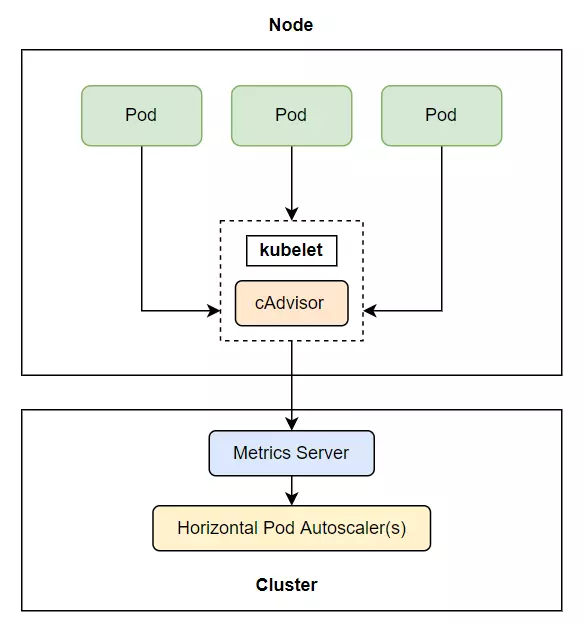
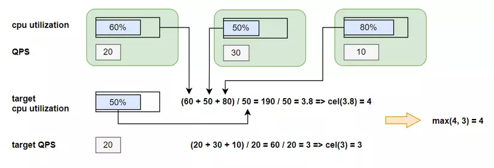

# Bài 16 - Automatic scaling Pod và cluster
- Chào các bạn tới với series về kubernetes. Đây là bài thứ 16 trong series của mình, ở bài trước chúng ta đã nói về cách quản lý tài nguyên của Pod trên cluster chúng ta như thế nào là hiệu quả nhất, ở bài này chúng ta sẽ nói về một chủ đề mà mình thấy là thú vị nhất, đó là autoscaling Pod và cluster.

- Nói về scale thì có 2 cách scale là horizontal scaling và vertical scaling:
    + Horizontal scaling là cách scale mà ta sẽ tăng số lượng worker (application) đang sử lý công việc hiện tại ra nhiều hơn. Ví dụ ta đang có 2 Pod để xử lý tích điểm cho client khi client tạo deal thành công, khi số lượng client tăng đột biến, 2 Pod hiện tại không thể xử lý kịp, ta sẽ scale số lượng Pod lên thành 4 Pod chẳng hạn.
    + Vertical scaling là cách scale thay vì tăng số lượng worker lên, ta sẽ tăng số lượng tài nguyên có thể sử dụng của ứng dụng đó lên, như là tăng số lượng cpu và memory của ứng dụng đó. Ví dụ ta có một model để train AI, thì việc train AI này ta không thể tách ra một model khác để tăng tốc độ train được, mà ta chỉ có thể tăng cpu và memory cho model đó.
- Trong kubernetes, ta horizontal scale bằng cách tăng số lượng ở thuộc tính replicas của ReplicationController, ReplicaSet, Deployment. Vertical scale bằng cách tăng resource requests và limits của Pod. Ta có thể làm việc này bằng tay, nhưng sẽ gặp rất nhiều bất lợi, ta không thể ngồi cả ngày để kiểm tra lúc nào ứng dụng của ta có nhiều client sử dụng nhất để ta kết nối lên kubernetes cluster rồi gõ câu lệnh để scale được, mà ta muốn công việc này có thể tự động được.

- Kubernetes có cung cấp cho chúng ta cách autoscaling dựa vào việc phát hiện cpu hoặc memory ta chỉ định đã đạt tới ngưỡng scale. Nếu ta xài cloud, nó còn có thể tự động tạo thêm worker node khi phát hiện không còn đủ node cho Pod deploy.

# Horizontal pod autoscaling

- Horizontal pod autoscaling là cách ta tăng giá trị replicas ở trong các scalable resource (Deployment, ReplicaSet, ReplicationController, hoặc StatefulSet) để scale số lượng Pod. Công việc này được thực hiện bởi Horizontal controller khi ta tạo một HorizontalPodAutoscaler (HPA) resource. Horizontal controller sẽ thường xuyên kiểm tra metric của Pod, và tính toán số lượng pod replicas phù hợp dựa vào metric kiểm tra của Pod hiện tại với giá trị metric mà ta đã chỉ định ở trong HPA resource, sau đó sẽ thay đổi trường replicas của các scalable resource (Deployment, ReplicaSet, ReplicationController, or StatefulSet) nếu nó thấy cần thiết.

- Ví dụ file config của một HPA sẽ như sau:

```yaml
apiVersion: autoscaling/v2
kind: HorizontalPodAutoscaler
metadata:
  name: micro-services-autoscale
spec:
  scaleTargetRef:
    apiVersion: apps/v1
    kind: Deployment
    name: microservice-user-products
  minReplicas: 2
  maxReplicas: 5
  metrics:
  - type: Resource
    resource:
      name: memory
      target:
        type: Utilization
        averageUtilization: 70
```

[https://kubernetes.io/docs/tasks/run-application/horizontal-pod-autoscale-walkthrough/]

- Ở file trên, ta chỉ định scalable resource bằng thuộc tính scaleTargetRef, ta chọn resource ta muốn scale là Deployment và tên của Deployment đó, ta chỉ định số lượng min và max replicas bằng 2 thuộc tính minReplicas, maxReplicas. Metric mà ta muốn thu thập là memory, với giá trị ngưỡng là 70%. Khi metric thu thập được từ Pod vượt qua giá trị này, quá trình autoscaling sẽ được thực thi.

## Quá trình Autoscaling

Quá trình autoscaling được chia thành 3 giao đoạn như sau:
- Thu thập metrics của tất cả các Pod được quản lý bởi scalable resource mà ta chỉ định trong HPA.
- Tính toán số lượng Pod cần thiết dựa vào metrics thu thập được.
- Cập nhật lại trường replicas của scalable resource.

## Thu thập metrics
- Horizontal controller sẽ không trực tiếp thu thập metrics của Pod, mà nó sẽ lấy thông qua một thằng khác, được gọi là `metrics server`. `Ở trên từng worker node, sẽ có một thằng được gọi là cAdvisor, đây là một component của kubelet`, có nhiệm vụ thu thập metric của Pod và node, sau đó những metric này sẽ được tổng hợp ở metrics server, và thằng horizontal controller sẽ lấy metric từ metrics server ra.



- Ta cần lưu ý một điều ở đây là thằng metrics server này là một add-ons, chứ nó không có sẵn trong kubernetes cluster của ta, nếu ta muốn sử dụng được tính năng autoscaling, ta cần phải cài metrics server này vào. Cách cài thì các bạn xem ở đây https://github.com/kubernetes-sigs/metrics-server.

## Tính toán số lượng Pod cần thiết

- `Sau khi horizontal controller thu thập được metric`, nó sẽ tiến hành giai đoạn tiếp theo là tính toán số lượng Pod dựa theo metric thu thập được với số metric ta chỉ định trong HPA, nó sẽ tính ra số replicas từ hai thằng metric ở trên theo một công thức có sẵn. Với giá trị đầu vào là một nhóm pod metrics và đầu ra là số replicas tương ứng. Công thức dạng đơn giản như sau:

```bash
desiredReplicas = ceil[currentReplicas * ( currentMetricValue / desiredMetricValue )]
```

### Cấu hình chỉ có một metric

- Khi một HPA cấu hình chỉ có một metric (chỉ có cpu hoặc memory) thì việc tính toán số lượng Pod chỉ có một bước là sử dụng công thức trên. Ví dụ ta có giá trị current metric hiện tại là 200m, giá trị desired là 100m, current replicas là 2, ta sẽ có:

```bash
currentMetricValue / desiredMetricValue = 200m / 100m = 2

desiredReplicas = ceil[2 * (2)] = 4
```

- Số lượng replicas của ta bây giờ sẽ được scale từ 2 lên 4. Một ví dụ khác là ta có giá trị current metric hiện tại là 50m, , giá trị desired là 100m, ta sẽ có:

```bash
currentMetricValue / desiredMetricValue = 50m / 100m = 0.5
```
- Horizontal controller sẽ bỏ qua việc scale up khi giá trị của `currentMetricValue / desiredMetricValue` xấp xỉ 1.

### Cấu hình nhiều metric
- Khi HPA của ta cấu hình mà có nhiều metric, ví dụ có cả cpu và Queries-Per-Second (QPS), thì việc tính toán cũng không phức tạp hơn lắm, horizontal controller sẽ tính ra giá trị replicas của từng thằng metric riêng lẻ, sau đó sẽ lấy giá trị replicas lớn nhất.

```bash
max([metric_one, metric_two, ...n])
```

- Ví dụ, ta có số replicas sau khi tính ra của cpu là 4, của Queries-Per-Second là 3, thì max(4, 3) = 4, số lượng replicas sẽ được scale lên là 4.



## Cập nhật trường replicas

- Đây là bước cuối cùng của quá trình autoscaling, horizontal controller sẽ cập nhật lại giá trị replicas của resoucre ta chỉ định trong HPA, và để resoucre đó tự động thực hiện việc tăng số lượng Pod hoặc giảm số lượng Pod. Hiện tại thì autoscaling chỉ hỗ trợ các resource sau đây:
    + Deployments
    + ReplicaSets
    + ReplicationControllers
    + StatefulSets


