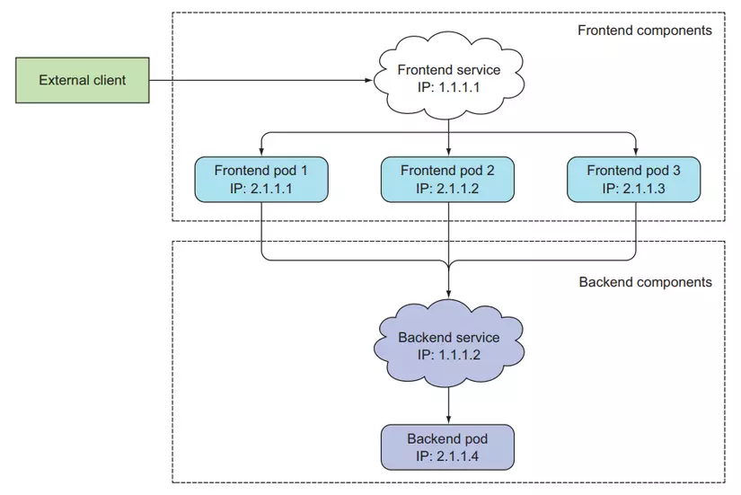
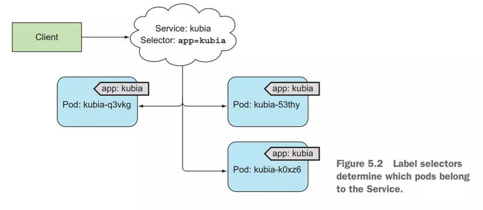
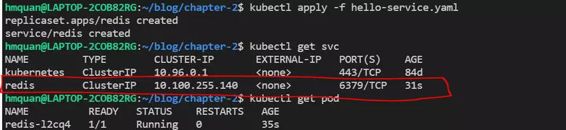
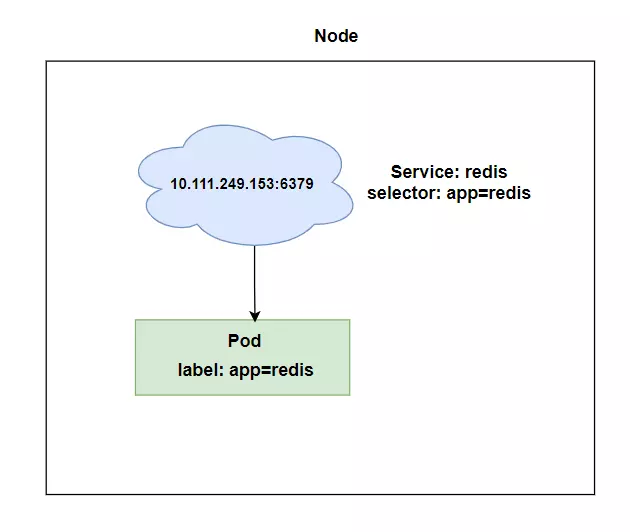
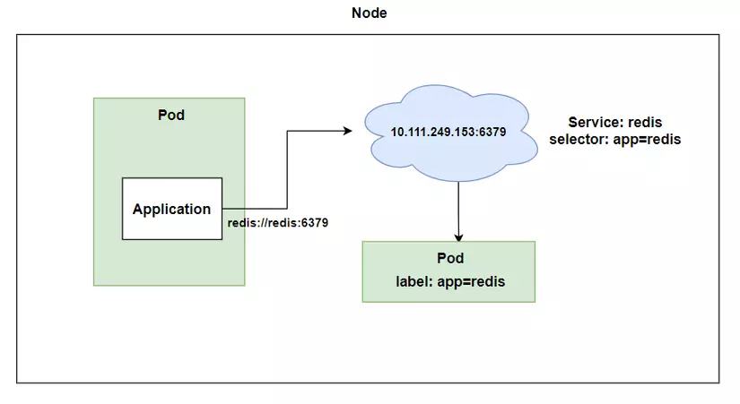
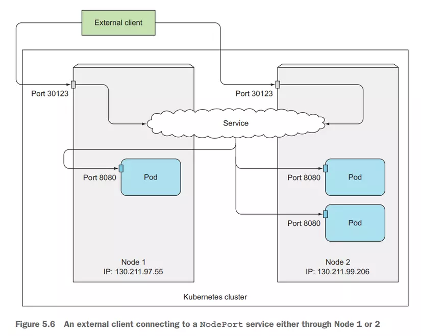
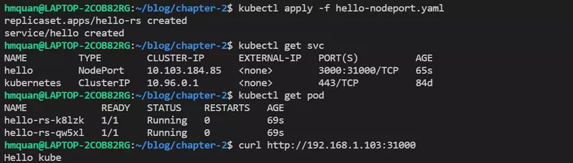
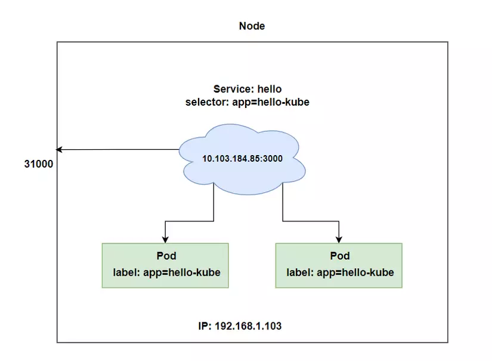
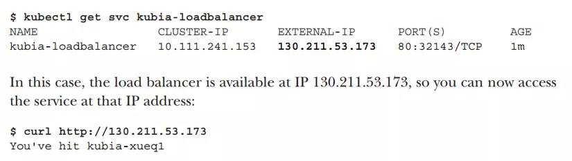
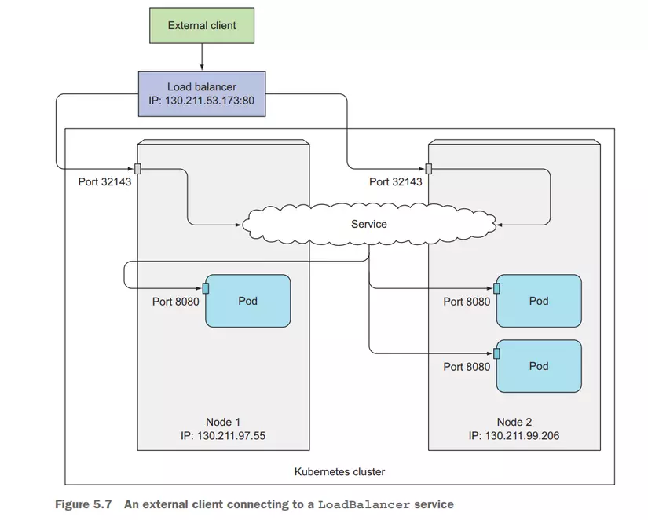

# Bài 4 - Services: expose traffic cho pod


# Kubernetes Services là gì?

- Là một resouce sẽ tạo ra một single, constant point của một nhóm Pod phía sau nó. Mỗi service sẽ có một địa chỉ IP và port không đổi, trừ khi ta xóa nó đi và tạo lại. Client sẽ mở connection tới service, và connection đó sẽ được dẫn tới một trong những Pod ở phía sau.



- `Vậy service giúp ta những vấn đề gì? Mỗi thằng Pod nó cũng có địa chỉ IP riêng của nó, sao ta không gọi thẳng nó luôn mà thông qua service chi cho mất công? Để trả lời những câu hỏi này thì ta sẽ nói qua một vài vấn đề.`

# Pods are ephemeral

- Có nghĩa Pod là một resource rất phù du, nó sẽ được tạo ra, bị xóa, và thay thế bằng một thằng khác bất cứ lúc nào, có thể là lúc ta muốn đổi một template khác cho Pod, Pod cũ sẽ bị xóa đi và Pod mới sẽ được tạo ra. Hoặc là trường hợp một woker node die, Pod trên worker node đó cũng sẽ die theo, và một Pod mới sẽ được tạo ra trên woker node khác.

- Khi tạo thằng pod mới tạo ra, nó sẽ có một IP khác với thằng cũ. Nếu ta dùng IP của Pod để tạo connection tới client thì lúc Pod được thay thế với IP khác thì ta phải update lại code.

# Multiple Pod run same application

- Có nghĩa là ta sẽ có nhiều pod đang chạy một ứng dụng của chúng ta để tăng performance. Ví dụ khi ta dùng ReplicaSet với replicas = 3, nó sẽ tạo ra 3 Pod. Vậy làm sao ta biết được nên gửi request tới Pod nào?

- Thì để giải quyết những vấn để trên thì Kubernetes cung cấp cho chúng ta `Services resource`, Service sẽ tạo ra một endpoint không đổi cho các Pod phía sau, client chỉ cần tương tác với endpoint này.

# Service quản lý connection như thế nào?

- Làm sao `Service` biết được nó sẽ chọn Pod nào để quản lý connection tới những Pod đó, nếu bạn còn nhớ `label selectors` ở những bài trước và cách ReplicaSet sử dụng label để quản lý Pod. Thì Services cũng sẽ sử dụng `label selectors` để chọn Pod mà nó quản lý connection.



```bash
apiVersion: v1
kind: Service
metadata:
  name: hello
spec:
  selector:
    app: hello-kube # label selectors Pod
  ports:
    - port: 80 # port of the serivce
      targetPort: 3000 # port of the container that service will forward to 
```

- Service sẽ có 4 loại cơ bản là:
    + ClusterIP
    + NodePort
    + ExternalName
    + LoadBalancer

# ClusterIP

- Đây là loại service sẽ tạo một IP và local DNS mà sẽ có thể truy cập ở bên trong cluster, không thể truy cập từ bên ngoài, được dùng chủ yếu cho các Pod ở bên trong cluster dễ dàng giao tiếp với nhau.
- Ví dụ như sau, ta có một application cần xài redis, ta sẽ deploy một Pod redis và application của ta cần kết nối với Pod redis đó. Với redis thì connection string của nó sẽ có dạng như sau redis://<host-name>:<port>, vậy ứng dụng ta sẽ kết nối với redis thế nào? Sau đây ta sẽ làm ví dụ tạo Pod redis và Service cho nó.
- Tạo một file tên là `hello-service.yaml`

```yaml
apiVersion: apps/v1
kind: ReplicaSet
metadata:
  name: redis
spec:
  replicas: 1
  selector:
    matchLabels:
      app: redis
  template:
    metadata:
      labels:
        app: redis
    spec:
      containers:
      - image: redis # redis image
        name: redis
        ports:
          - containerPort: 6379

---
apiVersion: v1
kind: Service
metadata:
  name: redis
spec:
  selector:
    app: redis # label selectors Pod redis
  ports:
    - port: 6379 # port of the serivce
      targetPort: 6379 # port of the container that service will forward to 

```

```bash
kubectl apply -f hello-service.yaml
```





- Bây redis của chúng ta sẽ có địa chỉ truy cập như sau redis://10.100.255.140:6379. Ta có thể thấy hostname của service của chúng ta ở đây là 10.100.255.140, ta có thể dùng địa chỉ này để các ứng ta deploy về sau truy cập được tới redis host.

- Vậy nếu ta có các ứng dụng đã chạy sẵn, thì làm sao ta kết nối tới host này được, không lẻ chúng ta phải update lại code? Thì để giải quyết vấn đề này, thay vì truy cập redis host thằng IP, ta có thể truy cập thông qua DNS, kubernes có cung cấp cho chúng ta một local DNS bên trong cluster, giúp chúng ta có thể connect được tới host ta muốn thông qua DNS. Ta có thể connect redis với địa chỉ sau r`edis://redis:6379`, `với host name là tên của Service chúng ta đặt trong trường metadata.`



Test thử service. Các bạn có thể tạo Pod để test bằng file config

```yaml
apiVersion: v1
kind: Pod
metadata:
  name: application
spec:
  containers:
    - image: 080196/hello-redis
      name: application

```

Hoặc tạo bằng cli cho nhanh 

```bash
kubectl run hello-redis --image=080196/hello-redis
```

Đây là code của application trong 080196/hello-redis image

```js
const redis = require("redis");

const client = redis.createClient("redis://redis:6379")

client.on("connect", () => {
  console.log("Connect redis success");
})

```

Kiểm tra log của pod, nếu in ra `Connect redis success` thì chúng ta đã kết nối được với redis host bằng dns

```bash
kubectl logs hello-redis
```


Clear resource

```bash
kubectl delete pod hello-redis
kubectl delete -f hello-service.yaml
```

- ClusterIP giúp các ứng dụng deploy trong cluster của ta giao tiếp với nhau dễ dàng hơn nhiều. Còn nếu chúng ta muốn client từ bên ngoài có thể truy cập vào ứng dụng của chúng ta thì sao? Có 3 cách đó là dùng `NodePort`, `LoadBalancer` (hỗ trợ clound), `Ingress`.

# NodePort

- Đây là cách đầu tiên để expose Pod cho client bên ngoài có thể truy cập vào được Pod bên trong cluster. Giống như ClusterIP, NodePort cũng sẽ tạo endpoint có thể truy cập được bên trong cluster bằng IP và DNS, đồng thời nó sẽ sử dụng một port của toàn bộ worker node để client bên ngoài có thể giao tiếp được với Pod của chúng ta thông qua port đó. NodePort sẽ có range mặc định từ 30000 - 32767. Ví dụ:

```yaml
apiVersion: v1
kind: Service
metadata:
  name: hello
spec:
  selector:
    app: hello-kube
  type: NodePort # type NodePort
  ports:
    - port: 80
      targetPort: 8080
      nodePort: 30123 # port of the worker node

```




- Client có thể gửi request tới Pod bằng địa chỉ 130.211.97.55:30123 hoặc `130.211.99.206:30123`. Và application bên trong cluster có thể gửi request tới Pod với địa chỉ `http://hello-kube`

- Giờ ta tạo thử NodePort service. Tạo một file tên là hello-nodeport.yaml

```bash
apiVersion: apps/v1
kind: ReplicaSet
metadata:
  name: hello-rs
spec:
  replicas: 2
  selector:
    matchLabels:
      app: hello-kube
  template:
    metadata:
      labels:
        app: hello-kube
    spec:
      containers:
      - image: 080196/hello-kube
        name: hello-kube
        ports:
          - containerPort: 3000

---
apiVersion: v1
kind: Service
metadata:
  name: hello
spec:
  selector:
    app: hello-kube
  type: NodePort
  ports:
    - port: 3000
      targetPort: 3000
      nodePort: 31000
```

```bash
kubectl apply -f hello-nodeport.yaml
```

Test gửi request tới Pod với địa chỉ http://<your_worker_node_ip>:<node_port>






# LoadBalancer

- Khi bạn chạy kubernetes trên cloud, nó sẽ hỗ trợ LoadBalancer Service, nếu bạn chạy trên môi trường không có hỗ trợ LoadBalancer thì bạn không thể tạo được loại Service này. Khi bạn tạo LoadBalancer Service, nó sẽ tạo ra cho chúng ta một public IP, mà client có thể truy cập Pod bên trong Cluster bằng địa chỉ public IP này. Ví dụ:

```bash
apiVersion: v1
kind: Service
metadata:
  name: kubia-loadbalancer
spec:
  selector:
    app: kubia
  type: LoadBalancer
  ports:
    - port: 80
      targetPort: 8080
```





# Ingress resource

- Ingress là một resource cho phép chúng ta expose HTTP and HTTPS routes từ bên ngoài cluster tới service bên trong cluster của chúng ta. Ingress sẽ giúp chúng ta gán một domain thực tế với service bên trong cluster. Ví dụ:

```yaml
apiVersion: extensions/v1beta1
kind: Ingress
metadata:
  name: kubia
spec:
  rules:
    - host: kubia.example.com # domain name
  http:
    paths:
      - path: /
        backend:
          serviceName: kubia-nodeport # name of the service inside cluster
          servicePort: 80
```


- Ta cũng có thể mapping nhiều service với cùng một domain. Ví dụ:

```yaml
apiVersion: extensions/v1beta1
kind: Ingress
metadata:
  name: kubia
spec:
  rules:
    - host: kubia.example.com
  http:
    paths:
      - path: /bar
        backend:
          serviceName: kubia-bar
          servicePort: 80
      - path: /foo
        backend:
          serviceName: kubia-foo
          servicePort: 80

```