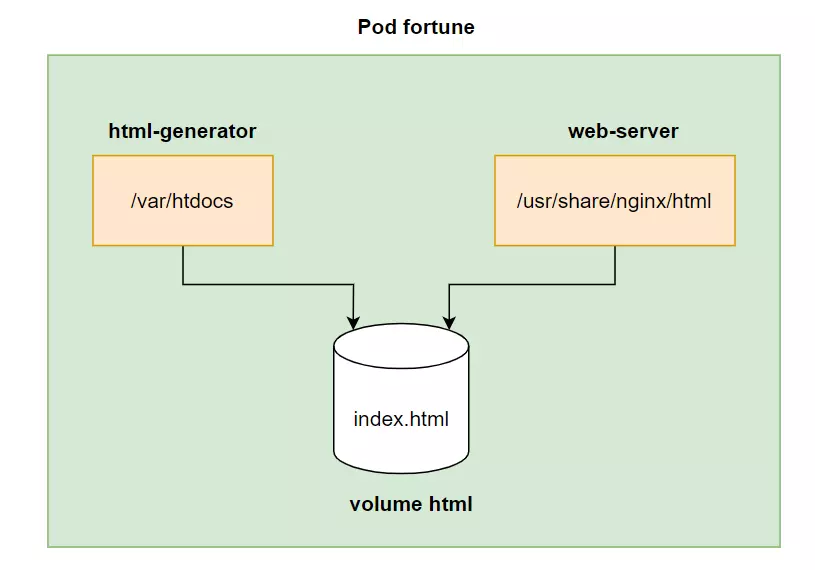
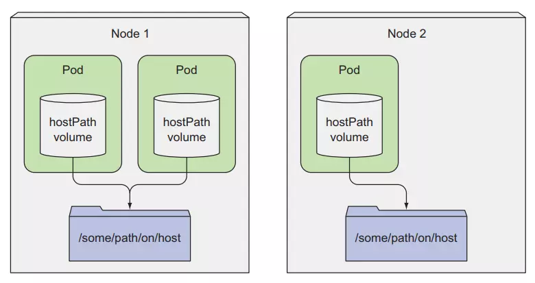
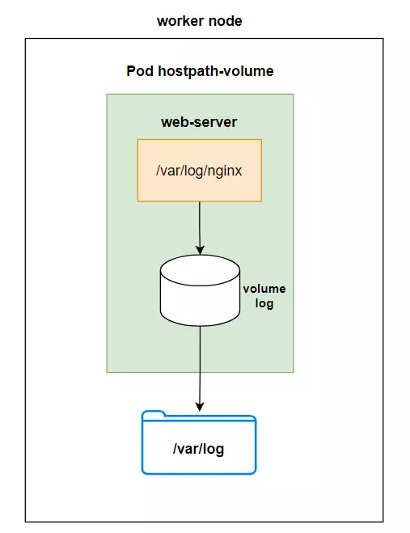
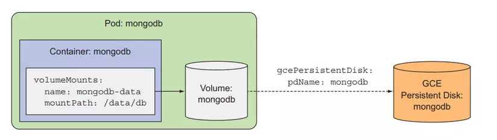

# Volume là gì?

- Volume hiểu đơn giản chỉ là một mount point từ hệ thống file của server vào bên trong container.

- Tại sao ta cần volume thì đối với container, những thứ ta ghi vào filesystem của nó thì chỉ tồn tại khi container còn chạy. Khi một thằng Pod bị xóa và tạo lại, container mới sẽ được tao ra, lúc này thì những thứ ta ghi ở container trước sẽ bị mất đi. Nếu ta muốn giữ lại những dữ liệu đó thì ta phải sử dụng volume.

- Trong kubernetes thì sẽ có những loại volume như sau:
    + emptyDir
    + hostPath
    + gitRepo
    + nfs
    + gcePersistentDisk, awsElasticBlockStore, azureDisk (cloud storage)
    + cinder, cephfs, iscsi, flocker, glusterfs, quobyte, rbd, flexVolume, vsphereVolume, photonPersistentDisk, scaleIO
    + configMap, secret, downwardAPI
    + PersistentVolumeClaim

- Những loại volume trên được phân chia thành 3 dạng chính:
    + Volume dùng để chia sẻ dữ liệu giữa các container trong Pod
    + Volume đính kèm vào trong filesystem một node
    + Volume đính kèm vào cluster và các node khác nhau có thể truy cập

- Chúng ta không cần phải nhớ hết các loại volume, xài tới đâu thì ta google tìm kiếm tới đó. Ta chỉ cần nhớ một vài loại hay sử dụng nhất là emptyDir, hostPath, cloud storage, PersistentVolumeClaim. Các loại secret, downwardAPI, configMap ta sẽ nói ở các bài tiếp.

- Khi ta chạy nhiều container trong cùng một Pod thì sẽ có lúc ta phát hiện rằng ta cần các container khác nhau có thể truy cập vào cùng một folder để ghi dữ liệu, và sẽ có những thằng container khác truy cập vào cùng một folder đó để lấy dữ liệu ra sử lý. Ta làm việc đó bằng cách nào? Thì kubernetes có cung cấp cho ta những loại volume khác nhau để làm được việc đó. Đầu tiên là `emptyDir`.


# Sử dụng emptyDir volume để share data giữ các containers

- emptyDir là loại volume đơn giản nhất, nó sẽ tạo ra một empty directory bên trong Pod, các container trong một Pod có thể ghi dữ liệu vào bên trong nó. Volume chỉ tồn tại trong một lifecycle của Pod, dữ liệu trong loại volume này chỉ được lưu trữ tạm thời và sẽ mất đi khi Pod bị xóa. Ta dùng loại volume này khi ta chỉ muốn các container có thể chia sẻ dữ liệu lẫn nhau và không cần lưu trữ dữ liệu lại. `Ví dụ là dữ liệu log từ một thằng container chạy web API, và ta có một thằng container khác sẽ truy cập vào log đó để xử lý log.`

- Ta sẽ làm một ví dụ đơn giản cho dễ hiểu hơn, tạo một file emptydir.yaml với config như sau:

```yaml
apiVersion: v1
kind: Pod
metadata:
  name: fortune
spec:
  containers:
    - name: html-generator
      image: luksa/fortune
      volumeMounts:
        - name: html # The volume called html is mounted at /var/htdocs in the container
          mountPath: /var/htdocs
    - name: web-server
      image: nginx:alpine
      ports:
        - containerPort: 80
          protocol: TCP
      volumeMounts:
        - name: html # The volume called html is mounted at /usr/share/nginx/html in the container
          mountPath: /usr/share/nginx/html
          readOnly: true
  volumes: # define volumes
    - name: html # name of the volumes
      emptyDir: {} # define type is emptyDir

```

- Code của script trong container luksa/fortune.

```bash
#!/bin/bash
trap "exit" SIGINT
mkdir /var/htdocs

while :
do
  echo $(date) Writing fortune to /var/htdocs/index.html
  /usr/games/fortune > /var/htdocs/index.html
  sleep 10
done
```

- Container html-generator này sẽ cứ mỗi 10 giây sẽ tạo ra một nội dung bất kì và lưu nó vào file index.html. Và ta sẽ có một container khác, tên là web-server, sẽ start một server và hosting nội dung ở folder /usr/share/nginx/html (folder mặc định của nginx).

- Ở đây ta có một emptyDir volume tên là html, được mount vào container html-generator ở folder /var/htdocs và container html-generator sẽ tạo một file html index.html ở trong emptyDir volume này. Và emptyDir volume này được mount tới container web-server, ở folder /usr/share/nginx/html. Nên khi ta truy cập container web thì ta sẽ thấy được những nội dung mà container html-generator đã tạo ra.



- Test xem nó có hoạt động đúng không.

```bash
kubectl apply -f emptydir.yaml
```

```bash
kubectl port-forward fortune 8080:80
Forwarding from 127.0.0.1:8080 -> 80
Forwarding from [::1]:8080 -> 80
```

```bash
curl http://localhost:8080
```

- Lưu ý là chỉ dùng emptyDir để chia sẻ dữ liệu giữa những container chứ không dùng để lưu persistent data. Tiếp theo là một loại volume rất hữu ích cho các static website là gitRepo.


# Sử dụng hostPath để truy cập filesystem của worker node
- hostPath là loại volume sẽ tạo một mount point từ Pod ra ngoài filesystem của node. Đây là loại volume đầu tiên ta nói mà có thể dùng để lưu trữ persistent data. Dữ liệu lưu trong volume này chỉ tồn tại trên một worker node và sẽ không bị xóa đi khi Pod bị xóa.



```yaml
apiVersion: v1
kind: Pod
metadata:
  name: hostpath-volume
spec:
  containers:
    - image: nginx:alpine
      name: web-server
      volumeMounts:
        - name: html
          mountPath: /usr/share/nginx/html
          readOnly: true
        - name: log # log volume
          mountPath: /var/log/nginx # mounted at /var/log/nginx in the container
      ports:
        - containerPort: 80
          protocol: TCP
  volumes:
    - name: html
      gitRepo: # gitRepo volume
        repository: https://github.com/luksa/kubia-website-example.git # The volume will clone this Git repository
        revision: master # master branch
        directory: . # cloned into the root dir of the volume.
    - name: log
      hostPath: # hostPath volume
        path: /var/log # folder of woker node
```

- Ở đây ta sẽ xài lại ví dụ ở trên, và thêm vào một volume tên là log, sẽ được mount tới file system của worker node ở folder /var/log, và volume này sẽ được mount tới container web-server ở folder /var/log/nginx. Lúc này thì tất cả log của container sẽ được lưu trữ ở folder /var/log của worker node.



- Đối với loại volume này thì Pod của ta cần phải được tạo đúng worker node thì ta mới có được dữ liệu trước đó, nếu Pod của ta được tạo ở một worker node khác thì khi đó Pod sẽ không có dữ liệu cũ, do dữ liệu vẫn nằm ở worker node cũ. Loại volume này ta không sử dụng nó cho việc lưu trữ persistent data hoàn toàn được. Cái ta muốn là dù Pod được tạo ở worker node nào thì dữ liệu của ta vẫn có, để mount được vào trong container.

# Sử dụng cloud storage để lưu trữ persistent data

- Loại volume này chỉ được hỗ trợ trên các nền tảng cloud, giúp ta lưu trữ persistent data, kể cả khi Pod được tạo ở các worker node khác nhau, dữ liệu của ta vẫn tồn tại cho container. 3 nền tảng cloud mà phổ biến nhất là AWS, Goolge Cloud, Azure tương ứng với 3 loại volume là gcePersistentDisk, awsElasticBlockStore, azureDisk.

- Thì ở ví dụ này ta sẽ xài Google Cloud, nếu các bạn có tài khoản Google Cloud và có kiến thức về nó rồi thì nên làm theo, còn không thì ta chỉ xem ví dụ cho biết thêm. Ta dùng câu lệnh sau để tạo một Persistent Disk trên google cloud:

- Thì ở ví dụ này ta sẽ xài Google Cloud, nếu các bạn có tài khoản Google Cloud và có kiến thức về nó rồi thì nên làm theo, còn không thì ta chỉ xem ví dụ cho biết thêm. Ta dùng câu lệnh sau để tạo một Persistent Disk trên google cloud:

```bash
gcloud compute disks create --size=1GiB --zone=europe-west1-b mongodb
```

Tạo một file tên là gcepd.yaml với config như sau:

```yaml
apiVersion: v1
kind: Pod
metadata:
  name: mongodb
spec:
  containers:
    - image: mongo
      name: mongodb
      ports:
        - containerPort: 27017
          protocol: TCP
      volumeMounts:
        - name: mongodb-data
          mountPath: /data/db
  volumes:
    - name: mongodb-data
      gcePersistentDisk: # google cloud disk volume
        pdName: mongodb # name of the persistent disk on google cloud
        fsType: ext4
```

```bash
kubectl create -f gcepd.yaml
```

- Ở đây ta sẽ tạo một volume loại gcePersistentDisk với name là mongodb-data và mount nó vào trong container mongodb ở folder /data/db.



- Vì loại volume này ta sẽ sử dụng GCE persistent disk, nên nó không thuộc về bất cứ worker node nào mà sẽ nằm riêng lẻ một mình nó. Khi Pod của chúng ta dù được tạo ở bất kì worker node nào thì ta vẫn có thể mount được tới volume này. Và dữ liệu của volume này vẫn được giữ nguyên khi Pod xóa đi.

- Để sử dụng volume của cloud storage khác thì ta chỉ cần thay đổi loại volume là được, rất đơn giản, ví dụ như sau:

Tạo volume:

```bash
aws ec2 create-volume \
    --size 1 \
    --availability-zone ap-southeast-1a \
    --volume-type gp2 \
    --tag-specifications 'ResourceType=volume,Tags=[{Key=Name,Value=mongodb}]'

aws ec2 describe-volumes

sudo mkdir -p /mnt/s3-bucket


s3fs volume-k8s /mnt/s3-bucket -o allow_other -o iam_role=auto -o url=https://s3.ap-southeast-1.amazonaws.com -o use_path_request_style

 mount | grep s3fs
```


```yaml
apiVersion: v1
kind: Pod
metadata:
  name: mongodb
spec:
  containers:
    - image: mongo
      name: mongodb
      ports:
        - containerPort: 27017
          protocol: TCP
      volumeMounts:
        - name: mongodb-data
          mountPath: /data/db
  volumes:
    - name: mongodb-data
      awsElasticBlockStore: # using AWS ElasticBlockStore instead of gcePersistentDisk
        volumeID: vol-01145e30b55d22efd # name of the EBS on AWS
        fsType: ext4
```

Bây giờ ta sẽ test thử bằng cách ghi dữ liệu vào trong mongodb-data container, và ta xóa Pod, khi ta tạo Pod lại, ta sẽ thấy dữ liệu của ta vẫn còn ở đó.

```bash
$ kubectl exec -it mongodb mongo
MongoDB shell version: 3.2.8
connecting to: mongodb://127.0.0.1:27017
Welcome to the MongoDB shell.
```

```sql
> use mystore
switched to db mystore
> db.foo.insert({name:'foo'})
WriteResult({ "nInserted" : 1 })
> db.foo.find()
{ "_id" : ObjectId("57a61eb9de0cfd512374cc75"), "name" : "foo" }
```

```bash
kubectl delete pod mongodb
kubectl create -f gcepd.yaml
```

```bash
$ kubectl exec -it mongodb mongo
MongoDB shell version: 3.2.8
connecting to: mongodb://127.0.0.1:27017
Welcome to the MongoDB shell.
...

> use mystore
switched to db mystore
> db.foo.find()
{ "_id" : ObjectId("57a61eb9de0cfd512374cc75"), "name" : "foo" }

```