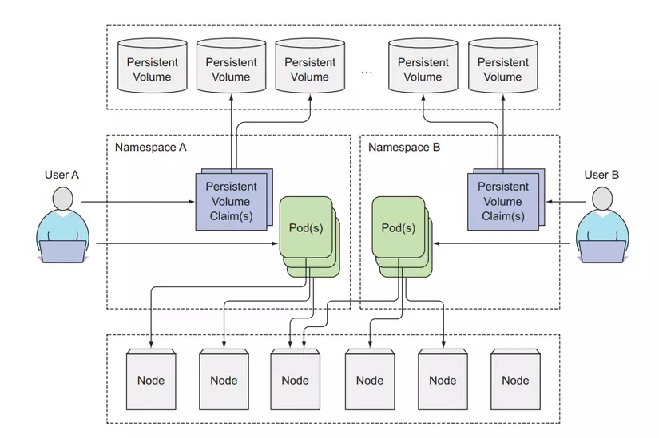
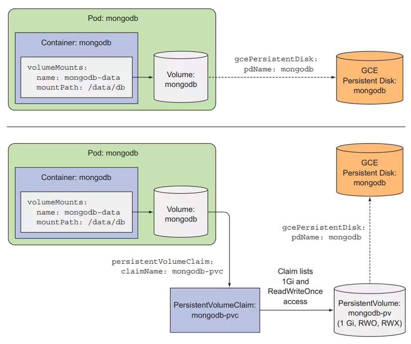
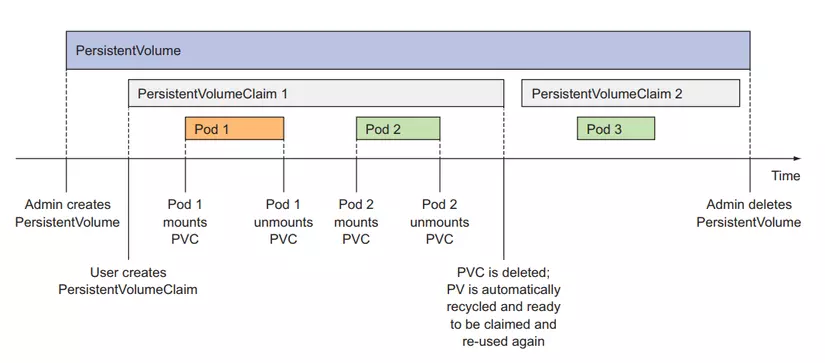

# Giới thiệu

- Chào các bạn tới với series về kubernetes. Đây là bài thứ 7 trong series của mình, ở các bài trước chúng ta đã nói về Volume, cách để gắn disk storage của worker node vào Pod. Ở bài này chúng ta sẽ nói về PersistentVolumeClaims, một loại của volume mà giúp ta tách Pod ra khỏi storage technology bên dưới.

- Tất cả những loại volume ta nói ở bài trước đều đòi hỏi developer phải biết về kiến trúc storage bên dưới của worker node. Ví dụ, ta muốn tạo một hostpath volume, ta cần phải biết hostpath dẫn tới folder nào của worker node, ta muốn tạo một awsElasticBlockStore volume, ta cần phải biết EBS name. Thì đối với một developer mà cần deploy ứng dụng có sử dụng volume trong kubernetes, cái ta muốn biết chỉ là size của volume, còn ở bên dưới volume nó xài kiến trúc storage nào thì ta không quan tâm lắm, ta không muốn ta cần phải chỉ định là Pod sẽ xài hostpath volume hoặc là awsElasticBlockStore, ta chỉ muốn quan tâm size mà thôi.

- Thì để làm được việc đó thì kubernetes cung cấp cho cúng ta 2 resource là PersistentVolumeClaims, PersistentVolumes.

# PersistentVolumeClaims, PersistentVolumes
- Với PersistentVolumes là resource sẽ tương tác với kiến trúc storage bên dưới, và PersistentVolumeClaims sẽ request storage từ PersistentVolumes, tương tự như Pod. Pods tiêu thụ node resources và PersistentVolumeClaims tiêu thụ PersistentVolumes resources.

Thông thường khi làm việc với kubernetes ta sẽ có 2 role là:
    + kubernetes administrator: người dựng và quản lý kubernetes cluster, cài những plugin và addons cần thiết cho kubernetes cluster.
    + kubernetes developer: người mà sẽ viết file config yaml để deploy ứng dụng lên trên kubernetes.
- Một kubernetes administrator sẽ setup kiến trúc storage bên dưới và tạo PersistentVolumes để cho kubernetes developer request và xài.


# Tạo PersistentVolumes

- Bây giờ ta sẽ là một cluster administrator và ta cần tạo PersistentVolume để cho cluster developer có thể request và xài. Tạo một file tên pv-gcepd.yaml với config như sau:

```bash
apiVersion: v1
kind: PersistentVolume
metadata:
  name: mongodb-pv
spec:
  capacity:
    storage: 10Gi # size of the storage
  accessModes: # access mode
    - ReadWriteOnce # can be mounted by a single wokrer node for reading and writing
    - ReadOnlyMany # can be mounted by a multiple wokrer node for reading only
  persistentVolumeReclaimPolicy: Retain
  gcePersistentDisk:
    pdName: mongodb
    fsType: ext4
```

- Khi cluster administrator tạo một PV, ta cần chỉ định size của PV này là bao nhiêu, và cần chỉ định access modes của nó, có thể được đọc và ghi bởi một node hay nhiều node. Ở ví dụ trên, thì chỉ có 1 node có quyền ghi vào PV này, còn nhiều node khác có quyền đọc từ PV này, kiến trúc storage của PV này xài là gcePersistentDisk, ta đã nói về loại volume này ở bài trước. Ta tạo thử PV ta vừa mới viết là list nó ra xem thử.

```bash
$ kubectl apply -f pv-gcepd.yaml
$ kubectl get pv
NAME        CAPACITY  RECLAIMPOLICY  ACCESSMODES  STATUS     CLAIM
mongodb-pv  10Gi      Retain         RWO,ROX      Available
```

- Bây giờ thì ta đã có PV. Tiếp theo thì ta sẽ đóng vai cluster developer để tạo PVCs và sẽ tiêu thụ PV này.

- PersistentVolumes sẽ không thuộc về bất kì namespace nào. Trong kubernetes thì có tồn tại 2 loại resource là namespace resource và cluster resource. Như Pod, Deployment thì là namspace resource, khi tạo Pod ta có thể chỉ định thuộc tính namespace và Pod sẽ thuộc về namespace đó, nếu ta không chỉ định namespace thì Pod sẽ thuộc default namespace. Còn cluster resource sẽ không thuộc về namespace nào, như là Node, PersistentVolumes resource.




# Tạo PersistentVolumeClaim tiêu thụ PersistentVolumes

- Bây giờ ta là developer, ta cần deploy Pod mà cần xài volume để lưu trữ persistent data. Tạo một file tên là mongodb-pvc.yaml với config như sau:

```yaml
apiVersion: v1
kind: PersistentVolumeClaim
metadata:
  name: mongodb-pvc
spec:
  resources:
    requests:
      storage: 10Gi # request 10Gi storage
  accessModes:
    - ReadWriteOnce # only allow one node can be read and write
  storageClassName: ""
```

- Ở đây ta sẽ tạo một PVC tên là mongodb-pvc mà request 10Gi storage, nếu có PV nào đáp ứng được nó, thì PVCs này sẽ tiêu thụ storage của PV đó. `Và thằng PV này chỉ cho phép một thằng worker node có quyền đọc và ghi vào nó`. Ở đây có một thuộc tính storageClassName ta chỉ định là rỗng, ta sẽ nói về thuộc tính này ở phần dưới. Tạo PVCs và list nó ra xem thử.

```bash
$ kubectl apply -f mongodb-pvc.yaml
$ kubectl get pvc
NAME         STATUS  VOLUME      CAPACITY  ACCESSMODES  AGE
mongodb-pvc  Bound   mongodb-pv  10Gi       RWO,ROX      3s
```

PVCs của ta đã được tạo ra và đã được Bound vào trong PVC, list PV ta tạo ở trên ra xem thử nó đã được xài bởi PVCs chưa.  

```bash
$ kubectl apply -f pv-gcepd.yaml
$ kubectl get pv
NAME        CAPACITY  RECLAIMPOLICY  ACCESSMODES  STATUS     CLAIM
mongodb-pv  10Gi      Retain         RWO,ROX      Bound      default/mongodb-pvc
```

`Ta thấy status của PV đã chuyển thành Bound và cột CLAIM đã hiển thị PVCs đang tiêu thụ nó.`

# Tạo Pod sử dụng PersistentVolumeClaim

- Bây giờ ta sẽ tạo Pod xài PVCs, tạo một file tên là mongodb-pod-pvc.yaml với config như sau:

```yaml
apiVersion: v1
kind: Pod
metadata:
  name: mongodb
spec:
  containers:
    - image: mongo
      name: mongodb
      volumeMounts:
        - name: mongodb-data
          mountPath: /data/db
      ports:
        - containerPort: 27017
          protocol: TCP
  volumes:
    - name: mongodb-data
      persistentVolumeClaim:
        claimName: mongodb-pvc # specify PVCs we want to use
```

- Để sử dụng PVCs, ta chỉ định nó trong thuộc tính volumes của Pod, thì mỗi PVCs tại một thời điểm chỉ có thể được xài bởi một Pod. Giờ ta thử tạo Pod và test, các bạn nhớ là ở bài trước ta đã tạo một gcePersistentDisk và insert dữ liệu vào trong đó chứ.

```bash
kubectl create -f mongodb-pod-pvc.yaml
```

```bash
$ kubectl exec -it mongodb mongo
MongoDB shell version: 3.2.8
connecting to: mongodb://127.0.0.1:27017
Welcome to the MongoDB shell.
```

```bash
> use mystore
switched to db mystore
> db.foo.find()
{ "_id" : ObjectId("57a61eb9de0cfd512374cc75"), "name" : "foo" }
```
Như chúng ta muốn, dữ liệu ta tạo ở bài trước vẫn nằm ở đây, nằm trong Persistent Disk của google cloud.



# Lợi ích của việc xài PersistentVolumeClaim

- Trong bài viết này thì các bạn sẽ thấy so sánh với volume thì xài PersistentVolumeClaim ta cần làm nhiều bước hơn. Nhưng với góc nhìn của developer khi làm thực tế thì bây giờ ta chỉ cần tạo PVCs và chỉ định size của nó, sau đó trong Pod ta chỉ cần chỉ định tên của PVCs, ta không cần phải làm việc với kiến trúc storage bên dưới node của ta, và ta cũng chả cần biết là dữ liệu ta được lưu ở worker node hay là ở storage của cloud hay là ở chỗ khác. Những thứ đó là việc của cluster administrator.

- Và file config của PVCs ta có thể xài lại ở những cluster khác được, trong khi ta xài volume thì ta cần phải xem là cluster đó hỗ trợ những kiến trúc storage nào trước, nên một file config có thể khó xài được ở những cluster khác nhau.

# Recycling PersistentVolumes

- Khi tạo PV thì ta để ý có một thuộc tính là persistentVolumeReclaimPolicy, thuộc tính này sẽ định nghĩa hành động của PV như thế nào khi PVCs bị xóa đi, có 3 mode là:
    + Retain
    + Recycle
    + Delete

- Ở mode `Retain policy`, khi ta delete PVCs thì PV của ta vẫn tồn tại ở đó, nhưng nó PV sẽ ở trạng thái là Release chứ không phải Available như ban đầu, vì nó đã được sử dụng bởi PVCs và chứa dữ liệu rồi, nếu để thằng PVCs bound vào thì có thể gây ra lỗi, dùng mode này khi ta muốn lỡ có ta có xóa PVCs thì dữ liệu của ta vẫn con đó, việc ta cần làm là xóa PV bằng tay, tạo ra PV mới là tạo ra PVCs mới để bound vào lại.

- Ta xóa thử thằng PVCs.

```bash
$ kubectl delete pod mongodb
pod "mongodb" deleted
$ kubectl delete pvc mongodb-pvc
persistentvolumeclaim "mongodb-pvc" deleted
$ kubectl get pv
NAME        CAPACITY  ACCESSMODES  STATUS    CLAIM              
mongodb-pv  10Gi      RWO,ROX      Released  default/mongodb-pvc
```

- Ở mode `Recycle policy`, khi ta delete PVCs thì PV của ta vẫn tồn tại ở đó, nhưng lúc này dữ liệu trong PV sẽ bị xóa đi luôn và trạng thái sẽ là Available để cho một thằng PVCs khác có thể tiêu thụ nó. Hiện tại thì GCE Persistent Disks không có hỗ Recycle policy.

- Ở mode `Delete policy`, khi ta xóa PVCs đi thì PV ta cũng bị xóa theo luôn.

- Ta có thể thay đổi policy của một thằng PV đang có, như là chuyển từ Delete sang Retain để tránh mất dữ liệu.



# Tự động cấp PersistentVolumes (Dynamic provisioning)

- Ta đã thấy cách sử dụng PV và PVCs với nhau để developer không cần làm việc với kiến trúc storage bên dưới. Nhưng ta vẫn cần một administrator setup những thứ đó trước. Để tránh việc đó thì Kubernetes có cung cấp ta một cách để tự động tạo PV bên dưới.
- `Cách mà administrator setup trước gọi là Pre provisioning, còn cách tự động gọi là Dynamic provisioning.`

- Để làm được việc này thì ta sẽ sử dụng StorageClasses với một provisioner (được cloud hỗ trợ mặc định), còn các môi trường không phải cloud thì ta phải cài provisioner.

# Tạo StorageClass

- Đây là resource sẽ tự động tạo PV cho ta, ta chỉ cần tạo StorageClass một lần, thay vì phải config và tạo một đống PV. Tạo một file tên là storageclass-fast-gcepd.yaml với config như sau:

```yaml
apiVersion: storage.k8s.io/v1
kind: StorageClass
metadata:
  name: fast
provisioner: kubernetes.io/gce-pd # use gce-pd provisioner
parameters:
  type: pd-ssd
  zone: europe-west1-b
```

- Ở đây ta tạo một StorageClass tên là fast, sử dụng gce-pd provisioner mà sẽ giúp ta tự động tạo PV bên dưới. Khi ta tạo một PVCs, ta sẽ chỉ định storageClassName là fast. Lúc này thì PVCs ta sẽ request tới StorageClass, và StorageClass sẽ tự động tạo một thằng PV bên dưới cho PVCs xài.

- Tạo một file tên là mongodb-pvc-dp.yaml với config như sau:

```yaml
apiVersion: v1
kind: PersistentVolumeClaim
metadata:
  name: mongodb-pvc
spec:
  storageClassName: fast # This PVC use fast StorageClass
  resources:
    requests:
      storage: 100Mi
  accessModes:
    - ReadWriteOnce
```

```bash
kubectl apply -f mongodb-pvc-dp.yaml
```

```bash
$ kubectl get pvc mongodb-pvc
NAME         STATUS  VOLUME        CAPACITY  ACCESSMODES  STORAGECLASS
mongodb-pvc  Bound   pvc-1e6bc048  1Gi       RWO          fast
$ kubectl get pv
NAME          CAPACITY  ACCESSMODES RECLAIMPOLICY  STATUS     STORAGECLASS
mongodb-pv    10Gi       RWO,ROX     Retain         Released
pvc-1e6bc048  1Gi        RWO         Delete         Bound     fast
```

- Ta sẽ thấy có một thằng pvc-1e6bc048 tự động được StorageClass tạo ra.


# Dynamic provisioning mà không cần chỉ định storage class

- Khi ta không chỉ định thuộc tính storageClassName trong PVCs thì nó sẽ xài storage class mặc định. Ta list thử storage class ra. Đây là storage class ở trên google cloud, ở dưới local của bạn có thể sẽ khác:

```bash
$ kubectl get sc
NAME                TYPE
fast                kubernetes.io/gce-pd
standard (default)  kubernetes.io/gce-pd
```

```yaml
apiVersion: v1
kind: PersistentVolumeClaim
metadata:
  name: mongodb-pvc
spec:
  resources:
    requests:
      storage: 100Mi
  accessModes:
    - ReadWriteOnce
```

- Như ở file config trên, ta không chỉ định thuộc tính storageClassName, nên PVCs này sẽ mặc định xài standard storageClassName.

- Còn nhở ở file config ban đầu của chúng ta, ta chỉ định thuộc tính storageClassName = "" chứ?

```yaml
...
kind: PersistentVolumeClaim
spec:
    storageClassName: ""
...
```

- Ý nghĩa của nó ở đây là ta sẽ không sử dụng storageClassName để tự động tạo PV mà ta sẽ xài PV có sẵn. Tại sao lại có như vậy, sao không xài storage class luôn đi cho nhanh mà phải tạo PV rồi xài, mất công thế? Như đã nói ở trên ta muốn xài được storage class thì ta cần provisioner, thì hiện tại chỉ có cloud là hỗ trợ sẵn provisioner thôi, nếu bạn cài trên data center thông thường thì không có provisioner sẵn cho bạn để bạn xài chức năng dynamic provisioning được.