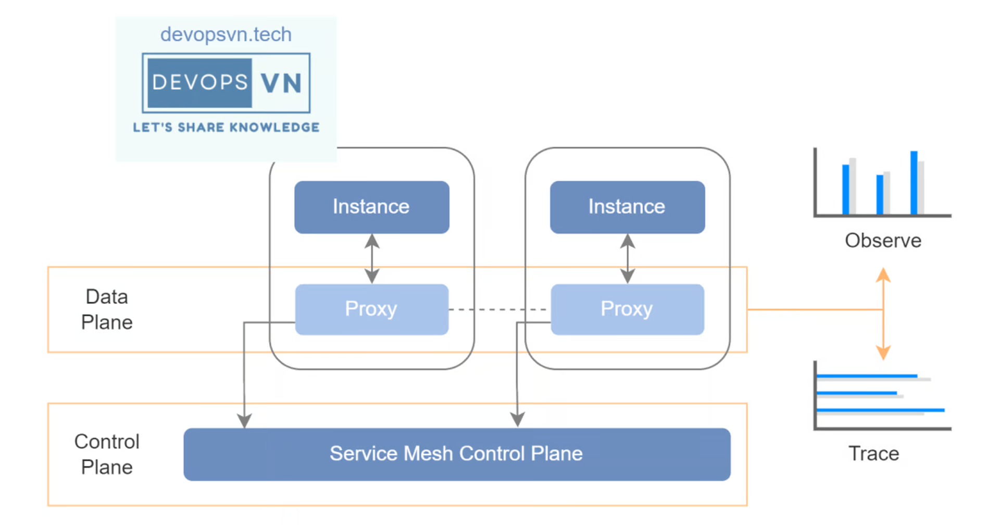
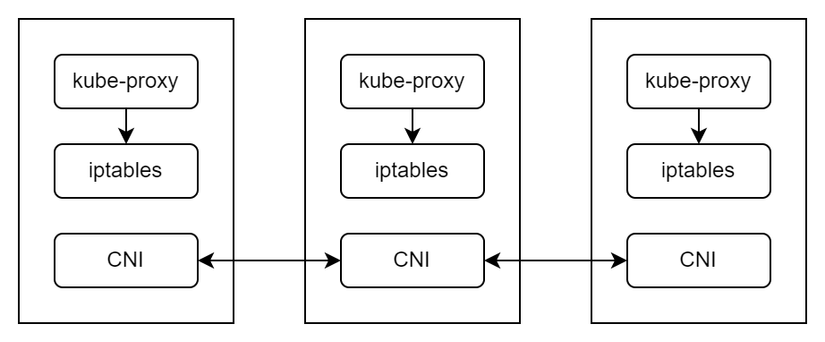
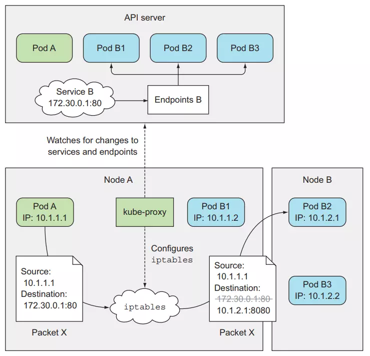

# Service Mesh on Kubernetes - Istio Introduction

- Việc triển khai hệ thống microservices lên trên server luôn luôn là một thử thách lớn, và khi Kubernetes được sinh ra thì nó đã giúp ta dễ dàng hơn phần nào trong việc triển khai hệ thống microservices lên trên server. `Nhưng ta sẽ đối mặc với thách thức tiếp theo là cách giao tiếp giữa các services bên trong Kubernetes, vì Kubernetes không được sinh ra như một giải pháp về networking, do đó Istio đã được ra đời, Istio được phát triển dựa trên Service Mesh.`

- Với K8S thì ta sẽ dùng Pod để triển khai services, trước khi tìm hiểu về Service Mesh thì ta sẽ xem cách giao tiếp mặc định giữa các Pod bên trong K8S như thế nào và nó bị hạn chế gì?

# Internal Pod Communication

- Trong K8S để các Pod nằm ở các worker node khác nhau có thể giao tiếp được với nhau thì K8S sử dụng `Container Network Interface (CNI)`, và ở bên trong một worker node để các Pod có thể giao tiếp được với nhau thì K8S sử dụng `kube-proxy`.

- Khi ta tạo một Pod hay Service thì kube-proxy sẽ thực hiện cập nhật iptables rules để các Pod có thể giao tiếp được với nhau, ví dụ như sau.

        