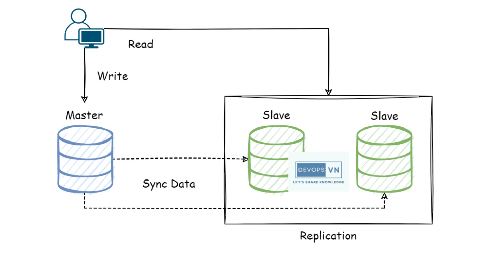
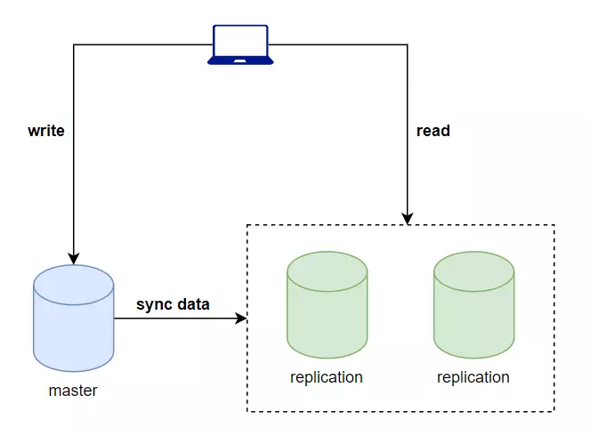

# Setup a database master-slave replication with PostgreSQL

- Chào mọi người đến với series practice về kubernetes. Ở bài này chúng ta sẽ tìm hiểu về cách triển khai một hệ thống database ở mode master-slave replication ở trên kubernetes.

- Trước khi nói về cách trển khai hệ database, thì ta sẽ nói qua database master-slave replication là gì và tại sao ta lại cần nó?



# Database Master-Slave Replication

- Đây là một hệ thống database bao gồm một master DB, và nhiều slave replication DB. Với master được sử dụng cho việc ghi dữ liệu, và các replication DB sẽ dùng cho việc đọc dữ liệu. Dữ liệu được ghi vào master DB sẽ được chuyển qua các replication DB để dữ liệu trên toàn hệ thống database của ta được đồng bộ với nhau.

- Trong một ứng dụng, chúng ta chỉ thường xài một DB cho cả việc đọc và ghi, nếu ứng dụng chỉ là các ứng dụng web bình thường và có lượt truy cập không cao thì việc sử dụng một DB như vậy thì cũng đủ đáp ứng yêu cầu rồi. Nhưng đối với các ứng dụng mà có lượt truy cập cao, việc chỉ sử dụng một DB cho cả việc đọc và ghi, sẽ dẫn tới ứng dụng của chúng ta không thể đáp ứng được tất cả các lượt truy cập của user hoặc là ứng dụng ta sẽ có hiệu suất rất kém. Vì vậy nên hệ thống DB master-slave replication này sẽ giúp ta tăng hiệu suất xử lý của ứng dụng lên nhiều, bằng cách tách ra việc ghi dữ liệu sẽ được ghi vào một DB được gọi là master, và khi đọc dữ liệu thì ta sẽ đọc từ các DB read replicas => tăng hiệu suất và tốc độ xử lý của ứng dụng



# Write k8s configuration file

- Bây giờ ta sẽ tiến hành viết file cấu hình để triển khai hệ thống lên kubernetes, ở bài này mình sẽ sử dụng PostgreSQL.

## Tạo master DB

- Tạo một file tên là `postgres-password-cm.yaml` để chứa thông tin password của PostgreSQL DB.

```yaml
apiVersion: v1
kind: ConfigMap
metadata:
  name: postgres-password
data:
  POSTGRES_USER: postgres
  POSTGRES_PASSWORD: postgres
  TIMESCALEDB_TELEMETRY: "off"
```

```bash
$ kubectl apply -f postgres-password-cm.yaml
configmap/postgres-password created
```

- Vì để demo nên ta sẽ sử dụng ConfigMap cho nhanh, còn khi làm thực tế ta sẽ dùng Secret. Đầu tiên ta sẽ tạo master DB trước, tạo một file tên là `postgres-master-sts.yaml`:

```yaml
apiVersion: apps/v1
kind: StatefulSet
metadata:
  name: postgres-master
  labels:
    component: postgres-master
spec:
  selector:
    matchLabels:
      component: postgres-master
  serviceName: postgres-master
  template:
    metadata:
      labels:
        component: postgres-master
    spec:
      containers:
        - name: postgres
          image: postgres:11
          command:
            [
              "sh",
              "-c",
              "docker-entrypoint.sh -c config_file=/var/config/postgresql.conf -c hba_file=/var/config/pg_hba.conf",
            ]
          ports:
            - containerPort: 5432
          envFrom:
            - configMapRef:
                name: postgres-password
          volumeMounts:
            - mountPath: /var/lib/postgresql/data
              name: postgres-data-master
            - mountPath: /var/config
              name: postgres-master-configmap
      volumes:
        - name: postgres-master-configmap
          configMap:
            name: postgres-master-configmap
  volumeClaimTemplates:
    - metadata:
        name: postgres-data-master
      spec:
        accessModes:
          - ReadWriteOnce
        storageClassName: hostpath
        resources:
          requests:
            storage: 5Gi

```


- Ở file config trên ta sử dụng image `postgres:11`, ở thuộc tính command ta sẽ truyền thêm vào câu lệnh để báo cho postgres biết là ta sẽ sử dụng custom config file cho nó, chứ không dùng config có sẵn của nó, hai file config ta chỉ định chỉ báo cho postgres biết nó đang là master DB. Để truyền hai file config trên vào DB được, ta sẽ sử dụng ConfigMap dạng volumeMounts, các bạn có thể đọc bài 8 của Kubernetes Series của mình để hiểu hơn về vấn đề này. ConfigMap chứa hai config đó có tên là postgres-master-configmap, giờ ta sẽ tạo nó.

Tạo một folder tên là config, mở nó ra và tạo thêm hai file tên là `postgresql.conf` và `pg_hba.conf`.

- postgresql.conf

```conf
listen_addresses = '*'
max_connections = 100
shared_buffers = 128MB
dynamic_shared_memory_type = posix

max_wal_size = 1GB
min_wal_size = 80MB
log_timezone = 'Etc/UTC'
datestyle = 'iso, mdy'
timezone = 'Etc/UTC'
lc_messages = 'en_US.utf8'
lc_monetary = 'en_US.utf8'
lc_numeric = 'en_US.utf8'
lc_time = 'en_US.utf8'
default_text_search_config = 'pg_catalog.english'

#------------------------------------------------------------------------------
# CUSTOMIZED OPTIONS
#------------------------------------------------------------------------------

# Add settings for extensions here
wal_level = replica
max_wal_senders = 2
max_replication_slots = 2
synchronous_commit = off
```

- File này là mình copy từ trong docker ra, tất cả config từ chỗ comment `# CUSTOMIZED OPTIONS` trở lên là mặc định của file ở trong docker, ta thêm config cho master db từ chỗ `# Add settings for extensions here` trở xuống. Còn file pg_hba.conf thì sẽ như sau.

```conf
# TYPE  DATABASE        USER            ADDRESS                 METHOD
local   all             all                                     trust
# IPv4 local connections:
host    all             all             127.0.0.1/32            trust
# IPv6 local connections:
host    all             all             ::1/128                 trust
# Allow replication connections from localhost, by a user with the
# replication privilege.
local   replication     all                                     trust
host    replication     all             127.0.0.1/32            trust
host    replication     all             ::1/128                 trust
host    replication     repuser         0.0.0.0/0               scram-sha-256
host    all             all             all                     md5
```

- Sau đó ta tạo ConfigMap.

```bash
$ kubectl create cm postgres-master-configmap --from-file=config
configmap/postgres-master-configmap created
```

- Sau khi tạo được ConfigMap thì tiếp theo ta sẽ tạo StatefulSet ở trên.

