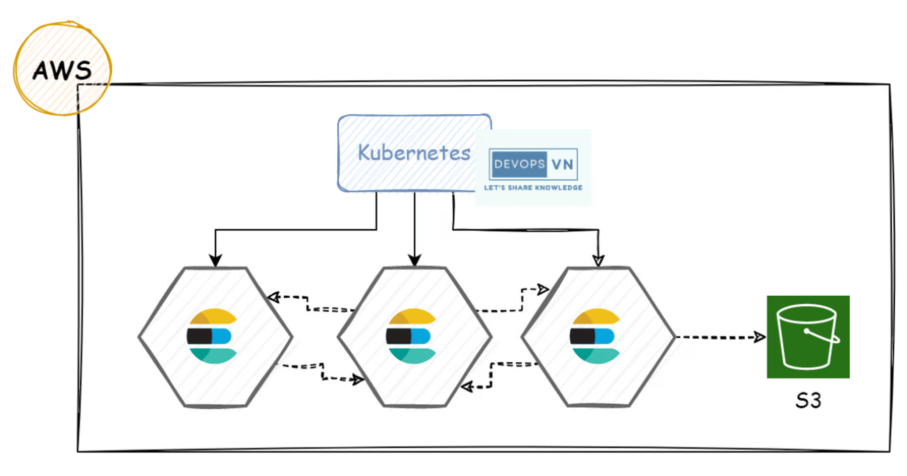
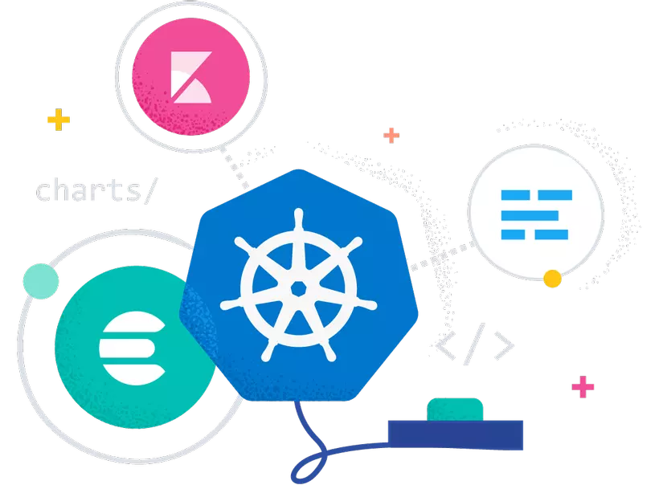

# Elasticsearch Cloud on Kubernetes (ECK)

- Chào mọi người đến với series practice về kubernetes. Ở bài này chúng ta sẽ tìm hiểu về cách triển khai Elasticsearch cluster lên trên môi trường cloud, và cách backup và restore Elasticsearch thông qua snapshot của Elasticsearch và S3 bucket.

- Để triển khai Elasticsearch thì có rất nhiều cách (ở đây mình bàn về triển khai Elasticsearch trên AWS):
    + Xài AWS Opensearch (Elasticsearch service), thằng này thì AWS nó quản lý scale, HA cho mình, dễ quản lý, nhưng tiền khá cao, hơn $400/month.
    + Deploy Elasticsearch lên trên kubernetes, giá tiền thì chắc chắn sẽ ít hơn khi xài của AWS Opensearch. Dễ scale và quản lý, tuy nhiên yêu cầu cần phải biết kubernetes.
    + Deploy Elasticsearch lên thẳng EC2, này thì sẽ không có HA sẵn, cần mình tự settup, bitnami nó có một ELK AMI sẵn (https://aws.amazon.com/marketplace/pp/prodview-tlbc33skxwrm6), mình chỉ cần tạo EC2 instance từ AMI này. Cách này thì giá tiền là ít nhất, chỉ cần con EC2 t3a.medium với 30GB là mình đủ chạy => khoảng $0.06/hr. Nhưng về HA, scale, backup, recovery thì mình tự làm khá nhiều.

- Tùy thuộc vào điều kiện thì ta sẽ chọn cách phù hợp, ở đây mình sẽ hướng dẫn cách triển khai dùng kubernetes.

# Elastic Cloud on Kubernetes

